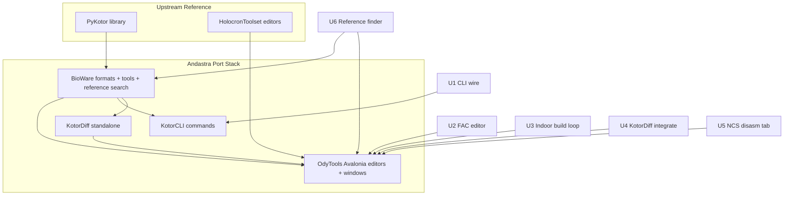

# feat: continue PyKotor and HolocronToolset port into Andastra

## Progress (2026-05-24)

| Unit | Status | Notes |
|------|--------|-------|
| U1 KotorCLI converts | **Landed** | plan 064 — BioWare `Conversions` wiring; closed plan **281** (2026-05-28). **21** FormatConvert tests. |
| U2 OdyToolFAC | **Landed** | plan 064 — FAC editor + standalone; closed plan **281** (2026-05-28). **3** OdyToolFAC tests. |
| U3 Indoor Builder | **Landed** | plan **065** — embed/save/open/build + Io/WriteLoad tests (closed plan **282**, 2026-05-28); walkmesh `AreaModel` tests via plan **069** (closed plan **279**). **3** IndoorMapIo + **4** WriteLoad tests. |
| U4 KotorDiff integrate | **Landed** | `KotorDiffWindow` hosts shared `KotorDiffApp`; closed plan **284** (2026-05-28). **4** KotorDiff tests; OdyTools net9.0 build clean. |
| U5 NCS disassembly tab | **Landed** | plan 067 — `DisassembleNcsBytes` + OdyToolNSS tab; closed plan **280** (2026-05-28). **3** ScriptsDisassembly tests. |
| U6 Reference finder Phase 1 | **Landed** | plan 068 — installation search, UTC menu, field paths; plan **066** closed via plan **278** (2026-05-28). |
| U6 Reference finder Phase 2 follow-up | **Landed** | plans 224–274 on `feat/holocron-port-phase-b` — tag/template/conversation/field-value search, options dialog, helper wiring tests; **174** reference-search tests (**95** BioWare `ReferenceFinder` + **79** OdyTools helper/UI). UTD/UTP/UTT script combo wiring from plan **069** (closed plan **279**). NCS StrRef `ReferenceCache` gating closed plan **286**; NCS CONSTS script ResRef scanner closed plan **287** (2026-05-28). Compiled NCS e2e tests closed plans **289**–**290**; post-#11-merge arc **291**–**294** closed plan **295** (2026-05-28). Authority: plan 068. |
| U6 KotorCLI find-2da-ref `--full-row` | **Landed** | plan **107** — BioWare `CollectTwoDARowReferences`, OdyTools delegate, KotorCLI `--full-row`; closed doc-only via plan **276** (2026-05-28). **13** KotorCLI + **2** BioWare TwoDARow tests. |
| U6 OdyTools 2DA row sweep tests + README | **Landed** | plan **108** — `WithTwoDA` label/StrRef collect tests (**10** TwoDAMemoryReferenceHelper total); KotorCLI README wired/stub accuracy; closed via plan **277** (2026-05-28). |
| U7 Doc sync | **Landed** | odytools-editor-ux.md updated |
| Deferred follow-up (plan 070) | **Landed** | FAC removal tests, KotorCLI grep/diff + format convert integration; closed plan **283** (2026-05-28). |

**Reference-search follow-up verification (2026-05-28):**

```bash
dotnet test tests/OdyTools.Tests/OdyTools.Tests.csproj --framework net9.0 --filter ReferenceFinder
dotnet test tests/OdyTools.Tests/OdyTools.Tests.csproj --framework net9.0 --filter FullyQualifiedName~ReferenceSearchHelperTests
dotnet test tests/OdyTools.Tests/OdyTools.Tests.csproj --framework net9.0 --filter FullyQualifiedName~ScriptReferenceHelperTests
dotnet test tests/OdyTools.Tests/OdyTools.Tests.csproj --framework net9.0 --filter FullyQualifiedName~StrRefReferenceHelperTests
dotnet test tests/OdyTools.Tests/OdyTools.Tests.csproj --framework net9.0 --filter FullyQualifiedName~TwoDAMemoryReferenceHelperTests
```

## Summary

Continue the PyKotor → BioWare and HolocronToolset → OdyTools port in vertical slices: wire KotorCLI commands to existing BioWare converters, add the missing FAC editor, connect the Indoor Map Builder UI to `IndoorMap.Build`, integrate standalone KotorDiff into OdyTools, expose NCS disassembly in OdyToolNSS, and begin reference-finder parity. Each unit follows BioWare-first, build-ladder validation, and Holocron 1:1 editor patterns.

---

## Problem Frame

BioWare and OdyTools already cover most PyKotor format parsers and Holocron per-format editors (32/35 editor classes), but compile-green status masks functional gaps: FAC opens as generic GFF, Indoor Map Builder cannot build modules from the UI, KotorCLI advertises STUB commands that BioWare already implements (some with false-success exit codes), in-app KotorDiff is a placeholder while the standalone tool works, and reference-finder / NCS disassembly workflows from Holocron are incomplete. Mod authors still hit dead ends that Holocron/PyKotor handle today.

---

## Assumptions

*This plan was authored without synchronous user confirmation. Review these bets before implementation.*

- **FAC scope:** `OdyToolFAC` targets installation/module `repute.fac` editing first; save-game nested FAC is deferred unless trivial via existing SAV capsule paths.
- **Indoor Builder MVP:** Wire Build/Save/Open and headless walkmesh validation before expanding renderer/paint UI.
- **KotorCLI stubs:** Delegate to `BioWare.Tools.Conversions` and related helpers; STUB commands must never exit 0 without producing output.
- **KotorDiff integration:** In-process call into shared KotorDiff library/executor from OdyTools rather than spawning external processes.
- **Reference finder Phase 1:** Port script/tag/resref search API to BioWare and wire UTC script fields as the template; NCS bytecode scanning **landed** via plans **286** (StrRef CONSTI cache) and **287** (script ResRef CONSTS scanner).
- **NCS UI:** Tabbed decompile + read-only disassembly using `Scripts.DisassembleNcs`; no separate NSEditor project initially.
- **Vendor wiki:** `vendor/src/toolset/wiki/` and upstream GitHub repos are reference-only; Andastra KB + `src/` are authority.

---

## Requirements

### Editor & tool UX

- R1. Close Holocron editor parity gap for FAC (`repute.fac`) with structured faction/reputation UX, not generic GFF tree.
- R3. Indoor Map Builder: expose Build/Save/Open `.mod` from UI calling `IndoorMap.Build` and `IndoorMapIo`; validate walkmesh output with automated tests before claiming walkability fixes.
- R4. Replace OdyTools `KotorDiffWindow` stub with working diff invocation (shared with `src/Tools/KotorDiff/`).
- R5. Add read-only NCS disassembly view in `OdyToolNSS` using BioWare `Scripts.DisassembleNcs`.
- R6. Reference finder Phase 1: BioWare search API + OdyTools context-menu wiring for script/tag/resref fields (UTC template); results show field paths.

### CLI & automation

- R2. Wire KotorCLI format-convert STUBs (`tlk2xml`, `xml2tlk`, `ssf2xml`, `xml2ssf`, `json2gff`) to existing BioWare converters with correct exit codes and file output.

### Cross-cutting

- R7. All units pass build-ladder validation (`docs/knowledgebase/50-execution/build-and-test-ladder.md`) and honor C# 7.3 / OdyPatch-only / standalone editor props conventions.
- R8. PyKotor traceability comments on new BioWare port code referencing upstream paths when applicable.

**Origin actors:** Mod author (primary), CI/automation agent (KotorCLI), tool maintainer (OdyTools/BioWare boundary)

**Origin flows:** F1 open FAC from installation; F2 kit → indoor module → in-game test; F3 CLI format convert; F4 in-app diff; F5 find script references; F6 inspect NCS bytecode

**Origin acceptance examples:** AE1 (FAC saves valid `repute.fac` roundtrip); AE2 (indoor build produces `.mod` with embedded `indoormap.txt`); AE3 (tlk2xml writes XML and exits non-zero on failure); AE4 (KotorDiff from Tools menu produces diff output); AE5 (UTC script field → reference results with paths)

---

## Scope Boundaries

- No HoloPatcher reintroduction; OdyPatch + OdyPatch.UI only.
- No PyKotor GL / full Module Designer 3D viewport (separate large effort).
- No Lip Syncer window, Metadata editor, or PLT parser in this plan.
- No Avalonia browser/CI GUI automation (manual/local validation for editor UX).
- No Andastra game-runtime engine fidelity work unless required for indoor walkmesh validation fixtures.

### Deferred to Follow-Up Work

- **Module Designer depth** (`ModuleDesignerWindow` 3D/GIT instance editing): separate plan after GL/renderer strategy.
- **Full reference finder NCS bytecode scanning** (`ReferenceCache` enablement): **fully landed** — StrRef CONSTI cache + `IncludeNcsStrRefScan` gating closed plan **286** (2026-05-28); CONSTS script ResRef scan closed plan **287** (2026-05-28). KB verification table synced in plan **288** (2026-05-28). GFF + SSF + helper wiring arc **complete** through plan 271; parent-plan doc closures **276–284** (2026-05-28) mark plans **107**, **108**, **066**, **069**, **067**, **064**, **065**, **070**, and U4 KotorDiff integration complete. E2e compiled NCS verification closed plans **289**–**291** (2026-05-28). Post-PR-#11-merge closure arc **291**–**294** (KB sync + KotorCLI `--ncs-strref-min` CLI tests) documented in plan **295** (2026-05-28).
- **Generic NCS CONST / 2DA-memory CONSTI disambiguation:** **partially landed** — `NcsConstiScanner.StrRefCandidateMinimum` (default 100) excludes low CONSTI from cache indexing; explicit StrRef slow-path still matches any CONSTI; OdyTools `NcsStrRefCandidateMinimum` + KotorCLI `--ncs-strref-min` (plans **095**/**099**). KB doc sync closed plan **292** (2026-05-28). KotorCLI slow-path + validation CLI tests closed plans **293**–**294** (2026-05-28). Opcode-context v1 closed plan **303** (2026-05-24): `GetConstiUsageContext` / `ShouldIndexAsStrRefCandidate` (StrRef ACTION lookahead + comparison exclusion). Action-signature slot matching closed plan **305** (2026-05-24): `ScriptDefs`-derived StrRef param map + multi-arg ACTION stack-slot alignment. Stack-store / CPTOPSP run-break heuristics closed plan **307** (2026-05-28): `StackStored` + spill/load abort in ACTION runs. Variable StrRef CPTOPSP→ACTION forward trace closed plan **309** (2026-05-29): `CPDOWNSP` store + `MOVSP`-adjusted `CPTOPSP` reload into StrRef ACTION slots. Global `CPDOWNBP`→`CPTOPBP` cross-subroutine trace closed plan **311** (2026-05-29): full-file BP offset match; **29** NcsConsti tests. Multi-hop local `CPDOWNSP`/`CPTOPSP` relay (`n→m→ACTION`) closed plan **313** (2026-05-29): chained forward hop; **31** NcsConsti tests. **Still deferred:** full stack simulation for exotic control-flow and arithmetic relays beyond one hop.
- **KotorCLI utility STUBs** (`grep`, `merge`, `diff`, `texture-convert`, `model-convert`, RIM pack, BIF extract matching): plan 059+.
- **2DA editor spreadsheet UX completion** (`docs/twoda_editor_ux_and_feature_completion.md`): orthogonal UX slice.
- **OdyPatch `--validate` automated subprocess test:** **landed** — `tests/OdyPatch.Tests/` + CI `test` job (plan **297**, 2026-05-28). CI `nuget-pack-smoke` validate smoke (plan 055) remains complementary. PR **#12** merged plans **291**–**298** to `master` @ `9860ada2a` (2026-05-28); post-merge tracker sync plans **299**–**312** merged via PR **#13**–**#22**, PR **#23** @ `ced72418b` (plan **309** variable StrRef CPTOPSP trace + tracker **310**, 2026-05-29), and PR **#25** @ `08bd4a3a3` (plan **311** global CPTOPBP trace + tracker **312**, 2026-05-29).
- **OdyPatch E2E mod install against real K1/TSL** ([plan 058 OdyPatch E2E runbook](2026-05-23-058-odypatch-e2e-runbook-plan.md)): runtime install validation (still deferred).
- **GIT/LYT advanced renderer widgets** (Holocron subpackages): after indoor builder stable.

---

## Context & Research

### Relevant Code and Patterns

- BioWare FAC models: `src/BioWare/Resource/Formats/GFF/Generics/FAC.cs`, `FACHelpers.cs`
- Editor routing: `src/Tools/OdyTools/Editors/WindowUtils.cs` (FAC currently falls through to generic GFF)
- Holocron 1:1 pattern: `docs/toolset-1to1-pattern-verification.md` — `Build()` deep-copy, direct UI reads, GFF bools as `GetUInt8() == 1`
- Standalone editor infra: `src/Tools/OdyTools/Standalone/OdyTools.Standalone.Editor.props`, unique `BaseIntermediateOutputPath` per csproj
- KotorCLI STUBs: `src/Tools/KotorCLI/Commands/FormatConvertCommands.cs`
- BioWare converters (already implemented): `src/BioWare/Tools/Conversions.cs`
- Indoor pipeline: `src/Tools/OdyTools/Data/IndoorMap.cs`, `src/BioWare/Tools/IndoorMapIo.cs`, `Windows/IndoorBuilderWindow.cs`
- KotorDiff standalone: `src/Tools/KotorDiff/`; OdyTools stub: `src/Tools/OdyTools/Windows/KotorDiffWindow.cs`
- NCS disassembly: `src/BioWare/Tools/Scripts.cs` (`DisassembleNcs`)
- Reference partial port: `src/BioWare/Tools/ReferenceCache.cs`, `ReferenceCacheHelpers.cs`
- Vendor Holocron reference: `vendor/src/toolset/gui/editors/`, `vendor/tests/gui/editors/`

### Institutional Learnings

- BioWare-first for formats (`docs/knowledgebase/10-architecture-runtime/bioware-library-boundary.md`)
- Build ladder order (`docs/knowledgebase/50-execution/build-and-test-ladder.md`)
- Editor fidelity marked `[OPEN]` in KB — parity tests required per slice (`docs/knowledgebase/30-product-ux/odytools-editor-ux.md`)
- Indoor walkability bugs documented (`docs/INDOOR_MAP_BUILDER_BUG_EXPLAINED.md`) — do not claim fixed without test + game validation

### External References

- PyKotor: https://github.com/OpenKotOR/PyKotor
- HolocronToolset: https://github.com/OpenKotOR/HolocronToolset
- FAC format wiki (vendor reference): `vendor/src/toolset/wiki/GFF-FAC.md`

---

## Key Technical Decisions

- **Vertical slices over horizontal sweeps:** Each U-ID lands BioWare logic + OdyTools/CLI surface + tests in one PR-sized unit to avoid doc/runtime drift.
- **FAC before Metadata:** FAC has complete BioWare helpers and blocks faction-aware template editing; Metadata is wiki-mapping-only with generic GFF fallback acceptable longer.
- **Indoor Builder: headless-first validation:** Automated walkmesh/adjacency tests on `IndoorMap.Build` output before investing in renderer hook-selection UI.
- **KotorCLI: fail-fast wiring:** Replace STUB log-and-exit-0 with delegate-to-BioWare; integration tests assert output files exist.
- **KotorDiff: shared executor:** OdyTools calls same diff entry point as CLI to avoid duplicate diff UI maintenance.
- **Reference finder: BioWare API layer:** Move search logic into BioWare (like PyKotor `reference_finder`); OdyTools only hosts dialogs and result navigation.

---

## Open Questions

### Resolved During Planning

- **FAC scope:** Installation/module `repute.fac` first; save-game path deferred.
- **Indoor MVP:** Build loop + tests before renderer polish.
- **KotorCLI false success:** Must fix `tlk2xml` exit 0 STUB in U1.

### Deferred to Implementation

- Exact KotorDiff in-process API surface (shared static runner vs project reference to KotorDiff library project).
- Whether indoor walkmesh fixtures from vendor Python tests can be copied/adapted under `tests/fixtures/`.
- Reference search default scope (override-only vs modules+chitin) — implement Holocron `ReferenceSearchOptions` parity in U6.

---

## High-Level Technical Design

> *This illustrates the intended approach and is directional guidance for review, not implementation specification. The implementing agent should treat it as context, not code to reproduce.*



**Phased delivery:** Phase A (U1–U2) = quick parity wins; Phase B (U3–U4) = workflow unblockers; Phase C (U5–U6) = author productivity; Phase D (U7) = validation/doc sync.

---

## Implementation Units

- U1. **Wire KotorCLI format convert STUBs to BioWare**

**Goal:** KotorCLI `tlk2xml`, `xml2tlk`, `ssf2xml`, `xml2ssf`, `json2gff` produce real output via BioWare `Conversions` with correct exit codes.

**Requirements:** R2, R7

**Dependencies:** None

**Files:**
- Modify: `src/Tools/KotorCLI/Commands/FormatConvertCommands.cs`
- Modify: `src/BioWare/Tools/Conversions.cs` (only if edge cases found during wiring)
- Test: `tests/BioWare.Tests/Formats/` (add or extend TLK/SSF/GFF JSON roundtrip tests if missing)
- Test: `tests/KotorCLI.Tests/` (create integration tests if project exists; otherwise BioWare.Tests + manual CLI smoke)

**Approach:**
- Replace STUB log branches with calls to existing `ConvertTlkToXml`, `ConvertXmlToTlk`, `ConvertSsfToXml`, `ConvertXmlToSsf`, `ConvertJsonToGff`.
- Exit 1 on missing input, conversion exception, or empty output path; never exit 0 without writing expected file.
- Mirror working patterns from `gff2json` / `gff2xml` commands in same file.

**Patterns to follow:**
- Existing working convert commands in `FormatConvertCommands.cs`
- `docs/knowledgebase/50-execution/build-and-test-ladder.md` step 1–2

**Test scenarios:**
- Happy path: `tlk2xml` on sample TLK writes valid XML; `xml2tlk` roundtrips
- Happy path: `ssf2xml` / `xml2ssf` roundtrip on fixture SSF
- Happy path: `json2gff` produces GFF readable by BioWare GFF reader
- Error path: missing input file → non-zero exit, no output file created
- Error path: malformed XML/JSON → non-zero exit with actionable stderr
- Integration: STUB commands no longer contain `TODO: STUB` log-only paths

**Verification:**
- `dotnet build src/Tools/KotorCLI/KotorCLI.csproj --framework net9.0` succeeds
- BioWare.Tests pass for implicated formats
- Manual `--help` and one convert command per format succeed

---

- U2. **Implement OdyToolFAC editor**

**Goal:** Holocron FACEditor parity — structured faction list and reputation matrix editing for `repute.fac`.

**Requirements:** R1, R7, R8

**Dependencies:** None (BioWare FAC helpers exist)

**Files:**
- Create: `src/Tools/OdyTools/Editors/OdyToolFAC.axaml`, `OdyToolFAC.axaml.cs`
- Create: `src/Tools/OdyTools/Editors/OdyToolFAC.Standalone.csproj`
- Modify: `src/Tools/OdyTools/Editors/WindowUtils.cs` (route `ResourceType.FAC` before generic GFF)
- Modify: `src/Tools/OdyTools/Editors/Editor.cs` or new-menu actions if Holocron has `actionNewFAC`
- Modify: `Andastra.sln` (standalone csproj entry)
- Test: `tests/OdyTools.Tests/OdyToolFACTests.cs` (new)

**Approach:**
- Load via `FACHelpers.ReadFac`; edit factions (name, parent, global) and reputation grid; save via `FACHelpers.DismantleFac` / write path consistent with other GFF generics.
- Follow 1:1 pattern: `Build()` deep-copies `FAC`, reads controls directly.
- Register in `EditorWikiMapping` (entry already exists for `OdyToolFAC`).
- Standalone csproj uses shared props; unique obj output path.

**Execution note:** Add characterization test loading vendor-style minimal FAC fixture before UI polish.

**Patterns to follow:**
- `OdyToolSSF.axaml.cs` or `OdyTool2DA` for grid/list editing patterns
- `vendor/src/toolset/gui/editors/fac.py` behavior (reference only)
- `docs/toolset-1to1-pattern-verification.md`

**Test scenarios:**
- Happy path: load sample FAC, modify faction name, save, reload — values persist
- Happy path: adjust reputation between two factions, save roundtrip
- Edge case: empty faction list handling
- Edge case: parent id `0xFFFFFFFF` (no parent) displays correctly
- Error path: corrupt GFF shows error dialog, no silent save
- Integration: `WindowUtils` opens `OdyToolFAC` for `.fac` resources, not `OdyToolGFF`

**Verification:**
- Standalone and AIO open FAC from installation resource browser
- `dotnet test tests/OdyTools.Tests/OdyTools.Tests.csproj --framework net9.0 --filter OdyToolFAC` passes

---

- U3. **Indoor Map Builder — wire Build/Save loop and walkmesh tests**

**Goal:** Mod authors can build a `.mod` from Indoor Map Builder UI; walkmesh output validated by automated tests addressing documented immobility/transition bugs.

**Requirements:** R3, R7

**Dependencies:** None (BioWare `IndoorMap.Build` exists)

**Files:**
- Modify: `src/Tools/OdyTools/Windows/IndoorBuilderWindow.cs`
- Modify: `src/Tools/OdyTools/Windows/IndoorMapRenderer.cs` (minimal hooks for build trigger only)
- Modify: `src/Tools/OdyTools/Data/IndoorMap.cs` (fix only if tests expose adjacency/walkmesh bugs)
- Modify: `src/BioWare/Tools/IndoorMapIo.cs` (if embed/read roundtrip gaps found)
- Test: `tests/OdyTools.Tests/IndoorMapBuildTests.cs` (new)
- Test: `tests/fixtures/indoor/` (new fixtures adapted from vendor tests if permissible)

**Approach:**
- Add Build, Save, Open actions: Build calls instance method `indoorMap.Build(installation, kits, outputPath)` on the window's `IndoorMap`; persist via standard save dialog; Open reloads `.mod` / embedded `indoormap.txt` via `IndoorMapIo`.
- Guard: require active installation (match existing window guards).
- Headless tests: build from minimal kit fixture; assert WOK/BWM face counts, door hook adjacency, `indoormap.txt` embed present — align with `vendor/tests` indoor builder tests as acceptance criteria.
- Document manual in-game test path in plan completion notes (warp + override layout); do not claim walkability fixed without test evidence.

**Execution note:** Characterization-first — port/adapt vendor `test_indoor_builder_roundtrip.py` expectations to C# before changing BWM logic.

**Patterns to follow:**
- `docs/INDOOR_MAP_BUILDER_BUG_EXPLAINED.md` failure modes as regression targets
- PyKotor indoor map comments in `IndoorMap.cs`

**Test scenarios:**
- Happy path: build from 2-room kit produces `.mod` on disk
- Happy path: embedded `indoormap.txt` roundtrips through Open
- Edge case: build without installation shows actionable error
- Edge case: invalid output path handled gracefully
- Integration: generated module WOK has non-zero walkable faces (fixture-specific threshold)
- Integration: adjacent rooms share door hook connectivity metadata (regression for transition bug)

**Verification:**
- UI Build button produces loadable `.mod`
- IndoorMapBuildTests pass on net9.0
- Build ladder: BioWare.Tests → OdyTools.Tests filtered

---

- U4. **Integrate KotorDiff into OdyTools**

**Goal:** Tools → KotorDiff runs real diff using shared KotorDiff engine; remove placeholder dialog.

**Requirements:** R4, R7

**Dependencies:** U1 optional (CLI hygiene unrelated)

**Files:**
- Modify: `src/Tools/OdyTools/Windows/KotorDiffWindow.cs`
- Modify: `src/Tools/OdyTools/OdyTools.csproj` (project reference to KotorDiff if needed)
- Modify: `src/Tools/OdyTools/Dialogs/TSLPatchDataEditorDialog.cs` (scan KotorDiff results — minimal hook if output format stable)
- Reference: `src/Tools/KotorDiff/` AppRunner / CliExecutor patterns

**Approach:**
- Replace info-only stub with in-process diff invocation passing paths from active installation or user-selected folders/files.
- Surface progress/output in window (text log or reuse KotorDiff Avalonia components if extractable).
- Optional: menu item to open full standalone KotorDiff GUI for TSLPatchData workflows.

**Patterns to follow:**
- Holocron `kotordiff.py` integration pattern (reference)
- Standalone `KotorDiff` `--gui` entry point

**Test scenarios:**
- Happy path: compare two folders produces diff output text/file
- Happy path: compare two MOD files completes without exception
- Error path: missing path shows error, no false success
- Integration: diff output format consumable by TSLPatchData editor scan (or documented as follow-up if format mismatch)

**Verification:**
- Tools menu KotorDiff no longer shows "not yet fully implemented"
- Manual smoke against known-different fixture pair

---

- U5. **NCS disassembly tab in OdyToolNSS**

**Goal:** Mod authors inspect NCS bytecode (instruction offsets) alongside decompiled NSS — Holocron NSEditor capability gap.

**Requirements:** R5, R7, R8

**Dependencies:** None

**Files:**
- Modify: `src/Tools/OdyTools/Editors/OdyToolNSS.axaml`, `OdyToolNSS.axaml.cs`
- Reference: `src/BioWare/Tools/Scripts.cs` (`DisassembleNcs`)
- Test: extend `tests/OdyTools.Tests/OdyToolNSSTests.cs`

**Approach:**
- Tabbed UI: "Source" (existing decompile/edit) + "Disassembly" (read-only, from `DisassembleNcs`).
- On decompile failure, disassembly tab still attempts bytecode listing; prevent saving placeholder error text as valid NSS without user acknowledgment.
- Show instruction offsets for HACKList/TSLPatcher workflows (Holocron wiki use case).

**Patterns to follow:**
- Holocron NSEditor / DeNCS disassembly display (reference)
- Existing OdyToolNSS decompile path via `ScriptDecompiler`

**Test scenarios:**
- Happy path: open `.ncs` → disassembly tab shows non-empty instruction list with offsets
- Happy path: open `.nss` → disassembly tab empty or shows compiled preview if compile-on-open exists
- Edge case: decompile failure still shows disassembly when bytecode valid
- Error path: invalid NCS bytes show error in disassembly tab, not silent empty
- Integration: disassembly output matches BioWare `Scripts.DisassembleNcs` golden sample for fixture NCS

**Verification:**
- Manual open of sample NCS shows offsets
- OdyToolNSS tests pass

---

- U6. **Reference finder Phase 1 (BioWare API + UTC wiring)**

**Goal:** Find script/tag/template_resref references across installation with field paths in results — Holocron cross-editor glue baseline.

**Requirements:** R6, R7, R8

**Dependencies:** U5 (disassembly helps script search validation, soft)

**Files:**
- Create or extend: `src/BioWare/Tools/ReferenceFinder.cs` (port PyKotor `reference_finder` surface)
- Modify: `src/BioWare/Tools/ReferenceCache.cs`, `ReferenceCacheHelpers.cs`
- Create: `src/Tools/OdyTools/Dialogs/ReferenceSearchOptionsDialog.axaml(.cs)`
- Modify: `src/Tools/OdyTools/Dialogs/FileResultsDialog.axaml.cs` (field path column)
- Modify: `src/Tools/OdyTools/Editors/OdyToolUTC.axaml.cs` (context menu template)
- Test: `tests/BioWare.Tests/Tools/ReferenceFinderTests.cs`
- Test: extend `tests/OdyTools.Tests/GFFBasedEditorTests.cs` or dedicated reference tests

**Approach:**
- BioWare layer: `FindScriptReferences`, `FindTagReferences`, `FindTemplateResRefReferences` with scope options (override, modules, chitin — match Holocron defaults).
- Return structured `ReferenceSearchResult` (file, field path, match context).
- OdyTools: `ReferenceSearchOptionsDialog`; wire UTC script fields first; extend to UTD/UTP/UTT in same unit if low incremental cost.
- NCS bytecode scanning **enabled** — StrRef CONSTI via `ReferenceCache` (plan **286**); script ResRef via `NcsConstStringScanner` (plan **287**). Generic CONSTI disambiguation **partially landed** via `StrRefCandidateMinimum` threshold + cache/slow-path split (plan **292**); opcode-context v1 via `ShouldIndexAsStrRefCandidate` (plan **303**); action-signature slot matching via `ScriptDefs` (plan **305**); full stack simulation remains deferred.

**Patterns to follow:**
- Existing TLK StrRef search via `ReferenceCacheHelpers`
- Holocron `setup_file_context_menu` / `ReferenceSearchOptions` (vendor reference)

**Test scenarios:**
- Happy path: search for script name finds UTC with matching `ScriptHeartbeat` field
- Happy path: results include field path string, not just file list
- Edge case: empty search term rejected
- Edge case: no matches shows empty results dialog, not exception
- Integration: double-click result opens correct editor (UTC) — navigation hook stub acceptable if opening file only in v1
- Error path: search without active installation prompts user

**Verification:**
- UTC context menu "Find References" returns structured results
- BioWare ReferenceFinderTests pass

---

- U7. **Port validation, tests, and KB sync**

**Goal:** Document slice completion, extend OdyTools.Tests coverage for new surfaces, update drift register.

**Requirements:** R7, R8

**Dependencies:** U1–U6

**Files:**
- Modify: `docs/knowledgebase/30-product-ux/odytools-editor-ux.md` (FAC, indoor, KotorDiff status)
- Modify: `docs/knowledgebase/20-domain-theory/file-format-catalog.md` (if FAC/CLI coverage changes)
- Modify: `docs/knowledgebase/40-operational-risk/documentation-drift-register.md` (new entries resolved)
- Modify: `docs/plans/README.md` (index 062 — next available after 061)
- Modify: `tests/OdyTools.Tests/README.md` (new test counts)

**Approach:**
- Run full build ladder through OdyTools.Tests (filter to new tests first, then wider if time).
- Mark KB items from `[OPEN]` to verified where evidence exists; leave game-install E2E `[OPEN]`.
- Capture institutional learning via `/ce-compound` if novel patterns discovered.

**Test expectation:** none for pure doc edits — validation is review + link check.

**Verification:**
- Build ladder green for touched projects
- KB reflects FAC editor and CLI convert status accurately

---

## System-Wide Impact

- **Interaction graph:** `WindowUtils` editor routing affects MainWindow resource open, Windows file associations, and standalone launcher; KotorCLI changes affect CI/agents invoking convert commands.
- **Error propagation:** CLI convert failures must not exit 0; editor load failures must surface dialogs, not fall back silently to generic GFF for FAC.
- **State lifecycle risks:** Indoor Build partial writes — use atomic write or temp-then-rename for `.mod` output; FAC save must not corrupt `repute.fac` without backup prompt (match other editors' save patterns).
- **API surface parity:** BioWare `Conversions` and new `ReferenceFinder` become shared by KotorCLI and potentially KotorDiff/TSLPatchData.
- **Integration coverage:** Reference finder crosses Installation scan + multiple editor types; indoor build crosses BioWare BWM + OdyTools renderer + file I/O.
- **Unchanged invariants:** OdyPatch TSLPatcher semantics, existing editor set (except FAC routing), game runtime engine code, HoloPatcher prohibition.

---

## Risks & Dependencies

| Risk | Mitigation |
|------|------------|
| Indoor walkability bugs persist after UI wiring | Headless tests from vendor acceptance criteria; manual game test checklist; no "fixed" claim without evidence |
| KotorCLI false exit 0 breaks automation | U1 explicitly fixes exit codes; add integration tests |
| Reference search performance on full installation | Scope limits in ReferenceSearchOptions; async scan with cancellation (Holocron pattern) |
| C# 7.3 constraint violations in new code | Review against `.cursorrules`; no nullable syntax in BioWare/OdyTools |
| Standalone csproj obj collision on parallel build | Unique `BaseIntermediateOutputPath` for OdyToolFAC.Standalone |
| Scope creep into Module Designer / 3D | Explicit deferral in Scope Boundaries |

---

## Documentation / Operational Notes

- Manual validation checklist for indoor modules: copy `.mod` to override, warp via cheat console, test room transitions (document in PR test plan).
- KotorCLI convert commands should appear in `docs/knowledgebase/50-execution/run-tools-reference.md` if not already listed.
- Vendor wiki remains reference-only per `documentation-drift-register.md`.

---

## Sources & References

- **User request:** continue porting OpenKotOR/PyKotor and OpenKotOR/HolocronToolset into Andastra
- **Upstream:** https://github.com/OpenKotOR/PyKotor , https://github.com/OpenKotOR/HolocronToolset
- Related KB: `docs/knowledgebase/10-architecture-runtime/bioware-library-boundary.md`, `docs/knowledgebase/10-architecture-runtime/tools-ecosystem.md`
- Related docs: `docs/toolset-1to1-pattern-verification.md`, `docs/INDOOR_MAP_BUILDER_BUG_EXPLAINED.md`
- Prior build recovery plans: `docs/plans/2026-05-23-013-fix-odytools-build-errors-plan.md` through 057
