# KotOR Save/Load: Complete Reference

**Binary:** k1_win_gog_swkotor.exe (K1), k2_win_gog_legacypc_swkotor2.exe (K2/TSL Legacy PC), k2_win_gog_aspyr_swkotor2.exe (K2 Aspyr). The save/load flow diagram and sections below are **unified**: K1 and K2 use the same GIT schema (list names, struct IDs, entity order). Where behavior or addresses differ, text uses "if K1 … / if TSL …" (or "K1: addr / K2: addr") instead of separate subsections. **Address equivalents** across all three programs are in the table below; K2 Aspyr addresses are N/A where code fingerprint matching failed (different build/optimization).

---

## Save/Load call flow (Mermaid)

Unified K1/TSL (K2): addresses and behavior are the same unless noted; **"if K1 … / if TSL …"** indicates conditional differences in the node text.

```mermaid
flowchart TD
    subgraph CALLERS["Callers (both games)"]
        SAVE_CALL["StallEventSaveGame\nStartNewModule"]
        LOAD_CALL["Main loop\n(progress param)"]
    end

    subgraph SAVE["SAVE FLOW (K1: 0x004b2e70 entry / K2: same structure)"]
        direction TB
        SM["StoreCurrentModule\nK1: 0x004b2e70\n(entry)"]
        SAVE_CALL --> SM
        SM --> SMS["SaveModuleStart\nK1: 0x004c8960"]
        SM --> SMI["SaveModuleInProgress\nK1: 0x004c3b10"]
        SM --> SMF["SaveModuleFinish\nK1: 0x004ca680"]

        SMS --> SGFF["Create ERF + IFO GFF\nCERFFile, CResGFF IFO"]
        SMS --> SI["SerializeIfoGameTime\nK1: 0x004c7050"]
        SMS --> SFAC["SaveModuleFAC\nK1: 0x004c3960\n(separate FAC file)"]
        SI --> SLIMBO["SaveLimboCreatures\nK1: 0x004c5bb0"]
        SI --> SVT_IFO["SaveVarTable script\nSaveVarTable var\nSaveEventQueue"]
        SI --> IFO_FIELDS["IFO root: Mod_*, game time\nMod_Area_list, scripts"]

        SMI --> SG["SaveGIT\nK1: 0x0050ba00\nK2: 0x004e7040"]
        SG --> SGBUCKET["GetObjectArray, bucket by type\nif K1: creature_stats->is_pc\nif TSL: vtable 0x30 + creature_stats 0x1198+0x6c"]
        SG --> SVT["CSWSScriptVarTable::SaveVarTable\nK1: 0x0059adb0"]
        SG --> SVT2["CSWVarTable::SaveVarTable\nK1: 0x0059b250"]
        SG --> SWB["WriteFieldBYTE: CurrentWeather\nWeatherStarted, TransPending\nTransPendNextID, TransPendCurrID"]
        SG --> SC["SaveCreatures\nK1: 0x00507680\nK2: 0x004e28c0"]
        SG --> SIT["SaveItems\nK1: 0x00507750 K2: 0x004e29a0"]
        SG --> SD["SaveDoors\nK1: 0x00507810 K2: 0x004e2a60"]
        SG --> STR["SaveTriggers\nK1: 0x005078d0 K2: 0x004e2b20"]
        SG --> SE["SaveEncounters\nK1: 0x00507990 K2: 0x004e2be0"]
        SG --> SW["SaveWaypoints\nK1: 0x00507a50 K2: 0x004e2ca0"]
        SG --> SSN["SaveSounds\nK1: 0x00507b10 K2: 0x004e2d60"]
        SG --> SP["SavePlaceables\nK1: 0x00507bd0 K2: 0x004e2e20"]
        SG --> SST["SaveStores\nK1: 0x00507ca0 K2: 0x004e2ef0"]
        SG --> SAE["SaveAreaEffects\nK1: 0x00507d60 K2: 0x004e2fb0"]
        SG --> SPR["SaveProperties\nif K1: SaveProperties 0x00506090\nif TSL: SaveAreaProperties 0x004e11d0"]
        SG --> SM2["SaveMaps\nK1: 0x005061d0 K2: 0x004e1320"]
        SG --> SPC["SavePlaceableCameras\nK1: 0x005062a0 K2: 0x004e13f0"]
        SG --> WR["CERFFile::WriteResource\narea resref, type 0x7e7"]

        SC --> SCR["SerializeCreature_K2\nK1: 0x00500610\nper creature"]
        SCR --> SS["CSWSCreatureStats::SaveStats\n0x005b1b90"]
        SCR --> SITL["ItemList + Equip_ItemList\nCSWSItem::SaveItem\nK1: 0x0055ccd0"]
        SCR --> SPER["AddList PerceptionList"]
        SCR --> SCB["CSWSCombatRound::SaveCombatRound\n0x004d3ec0"]
        SCR --> SLISTEN["CSWSObject::SaveListenData\n0x004cca50"]
        SCR --> SOBJ["CSWSObject::SaveObjectState\nK1: 0x004cec50"]

        SIT --> SITEM_ITER["SaveItem per element\nSaveObjectState per element"]
        SITEM_ITER --> SOBJ
        SD --> SDOOR["CSWSDoor::SaveDoor\nK1: 0x00588ad0\n14 scripts, trap, links"]
        SDOOR --> SOBJ
        STR --> STRIG["CSWSTrigger::SaveTrigger\nK1: 0x0058e660\nGeometry list struct ID 3"]
        STRIG --> SOBJ
        SE --> SENC["CSWSEncounter::SaveEncounter\nK1: 0x00591350"]
        SENC --> SENC_NEST["Geometry, CreatureList\nSpawnPointList, AreaList, SpawnList"]
        SENC --> SOBJ
        SW --> SWAY["CSWSWaypoint::SaveWaypoint\nK1: 0x005c8230"]
        SWAY --> SOBJ
        SSN --> SSOUND["CSWSSoundObject::Save\nper element"]
        SSOUND --> SOBJ
        SP --> SPLC["CSWSPlaceable::SavePlaceable\nK1: 0x00586a70\n16 scripts, ItemList"]
        SPLC --> SITL2["ItemList + CSWSItem::SaveItem"]
        SPLC --> SOBJ
        SST --> SSTR["CSWSStore::SaveStore\nK1: 0x005c6cd0"]
        SSTR --> SITL3["ItemList + SaveItem\n+ Infinite flag"]
        SSTR --> SOBJ
        SAE --> SEFF["CSWSAreaOfEffectObject::SaveEffect\nK1: 0x00594d80"]
        SEFF --> SOBJ

        SOBJ --> SEFFL["SaveEffectList\n0x004cc9d0"]
        SOBJ --> SVT3["SaveVarTable script\n0x0059adb0"]
        SOBJ --> SVT4["SaveVarTable var\n0x0059b250"]
        SOBJ --> SAQ["SaveActionQueue\n0x004cc7e0"]
        SOBJ --> SCMD["WriteFieldBYTE Commandable"]

        SITL --> SITEM["SaveItem: SaveContainerItems\nSaveItemProperties (recursive)"]
        SITL2 --> SITEM
        SITL3 --> SITEM

        SPR --> SAMB_SAVE["CSWSAmbientSound::Save\nper ambient"]
        SM2 --> MAP_WRITE["AreaMap: resX, resY\nVOID data blob"]
        SPC --> CAM_WRITE["AddListElement struct ID 0xe\nCameraID, Position, Orientation"]

        SMF --> SSTATIC["if not NWM: SaveStatic\nK1: 0x004c5980\nARE 0x7dc"]
        SMF --> SIFO["SaveModuleIFOFinish\nK1: 0x004c8b90"]
        SIFO --> SPLAY["SavePlayers\nK1: 0x004c7870\nMod_PlayerList"]
        SPLAY --> SCR_PLY["AddListElement 0xbead\nSerializeCreature_K2\nper player"]
        SIFO --> WR_IFO["WriteResource Module 0x7de"]
    end

    subgraph LOAD["LOAD FLOW (K1: 0x004c5720 entry / K2: same structure)"]
        direction TB
        LM["LoadModuleInProgress\nK1: 0x004c5720\n(entry)"]
        LOAD_CALL --> LM
        LM --> LA["LoadArea\nK1: 0x0050e190"]
        LA --> LAH["LoadAreaHeader"]
        LA --> LRI["LoadRoomInfo"]
        LA --> LG["LoadGIT\nK1: 0x0050dd80\nK2: 0x004e9440"]
        LA --> LPP["LoadPathPoints"]
        LA --> LPOST["Release ARE\nAddObjectToLookupTable"]

        LG --> LVTS["if saved_game: LoadVarTable script\nK1: 0x0059aa80"]
        LG --> LVTV["if saved_game: LoadVarTable var\nK1: 0x0059b0f0"]
        LG --> LWFB["ReadFieldBYTE CurrentWeather\nWeatherStarted, UseTemplates\nif area flags&1: current_weather=0xff"]
        LG --> LC["LoadCreatures\nK1: 0x00504a70 K2: 0x004dfbb0"]
        LG --> LI["LoadItems\nK1: 0x00504de0 K2: 0x004dff20"]
        LG --> LD["LoadDoors\nK1: 0x0050a0e0 K2: 0x004e56b0"]
        LG --> LTR["LoadTriggers\nK1: 0x0050a350 K2: 0x004e5920"]
        LG --> LE["LoadEncounters\nK1: 0x00505060 K2: 0x004e01a0"]
        LG --> LW["LoadWaypoints\nK1: 0x00505360 K2: 0x004e04a0"]
        LG --> LSN["LoadSounds\nK1: 0x00505560 K2: 0x004e06a0"]
        LG --> LPL["LoadPlaceables\nK1: 0x0050a7b0 K2: 0x004e5d80"]
        LG --> LST["LoadStores\nK1: 0x005057a0 K2: 0x004e08e0"]
        LG --> LAE["LoadAreaEffects\nK1: 0x00505af0 K2: 0x004e0c30"]
        LG --> LPR["LoadProperties\nif K1: LoadProperties 0x00507490\nif TSL: LoadAreaProperties 0x004e26d0"]
        LG --> LMP["LoadMaps\nK1: 0x00505da0 K2: 0x004e0ee0"]
        LG --> LPC["LoadPlaceableCameras\nK1: 0x00505eb0 K2: 0x004e0ff0\nno GetElementType both games"]

        LC --> LCR["if UseTemplates: LoadFromTemplate\nelse: LoadCreature\nK1: 0x00560970 / 0x005649f0"]
        LCR --> LOBJ
        LI --> LITEM["LoadItem per element\nif saved_game: LoadObjectState"]
        LITEM --> LOBJ
        LD --> LDOOR["CSWSDoor::LoadDoorExternal\nK1: 0x0058c5f0"]
        LDOOR --> LOBJ["LoadObjectState\nK1: 0x004d1cf0\nif saved_game"]
        LTR --> LTRIG["LoadTrigger\nK1: 0x0058da80"]
        LTRIG --> LOBJ
        LE --> LENC["LoadEncounter"]
        LENC --> LOBJ
        LW --> LWAY["LoadWaypoint"]
        LWAY --> LOBJ
        LSN --> LSOUND["LoadSoundObject per element"]
        LSOUND --> LOBJ
        LPL --> LPLC2["LoadPlaceable"]
        LPLC2 --> LOBJ
        LST --> LSTORE["LoadStore per element\nif UseTemplates: LoadFromTemplate"]
        LSTORE --> LOBJ
        LAE --> LAEFF["LoadAreaEffect\nK1: 0x00595d20"]
        LAEFF --> LOBJ

        LOBJ --> LEFFL["LoadEffectList\n0x004d1be0"]
        LOBJ --> LAQQ["LoadActionQueue\n0x004cecb0"]
        LPR --> LAMB["CSWSAmbientSound::Load\n0x0058e0a0"]
        LMP --> LMAP["CSWSAreaMap::LoadSavedAreaMapData"]
    end
```



**Unified K1/TSL (K2) convention:** Where a node shows "K1: 0x... K2: 0x...", both games use the same call order and GIT schema; only the function address differs. **Conditional behavior (shown in node text):** "if saved_game" = step runs only when loading a save (param_1 != 0); "if UseTemplates" = LoadCreatures/… use LoadFromTemplate when GIT root has UseTemplates != 0; "if not NWM" = SaveStatic runs only when module is not NWM. **PC detection (SaveGIT bucketing):** if K1: creature_stats->is_pc; if TSL: vtable offset 0x30 + creature_stats offset 0x1198+0x6c. **SaveProperties / LoadProperties:** if K1: SaveProperties / LoadProperties; if TSL: SaveAreaProperties / LoadAreaProperties. **Recursion:** SaveItem → SaveContainerItems, SaveItemProperties; SaveObjectState from every entity saver; SerializeCreature_K2 for both GIT Creature List and IFO Mod_PlayerList. **LoadPlaceableCameras:** neither game uses GetElementType; reads every CameraList element.

---

## C++ convention (rewrites)

The compilable C++ code blocks in this document follow these conventions:

- **Engine vs. abstract interface:** The engine uses `CResGFF`, `CResStruct`, `CResList` directly. Equivalent abstract interfaces exist in `src/KotORSaveLoadCpp/KotORSaveLoad.h` (`IGffWriter`, `IGffReader`) for portable implementations.
- **Parameter names:** Decompilation `param_1`, `param_2`, `this_00` are renamed to `gff`, `outStruct`, and the object type (e.g. `store`, `creature`, `door`) as appropriate.
- **Vtable indirection:** Calls like `(*(obj->vtable + 0x2c))(obj, ...)` are rewritten as named helpers, e.g. `GetCurrentHP(obj, arg)`, `GetConversation(obj, outRef)`, `GetPortraitId(obj)`, `GetPortrait(obj, outRef)`, `GetLocName(obj)`.
- **Types:** `undefined4` → `int`/`uint32_t`, `undefined2` → `uint16_t`, `undefined1` → `uint8_t`, with explicit casts where the decompiler did not infer semantics.

---

## Ghidra undefined types (RE reference)

When reading decompiled KotOR save/load code, Ghidra frequently emits `undefined` types when it cannot infer semantic meaning. These are built-in Ghidra types (Ghidra BuiltInTypes archive):

| Type | Size | Description | C/equivalent (32-bit x86) |
|------|------|-------------|---------------------------|
| **undefined1** | 1 byte | Undefined Byte | `char`, `byte`, `uint8_t`, `BOOL` (often) |
| **undefined2** | 2 bytes | Undefined Word | `short`, `word`, `uint16_t`, `ushort` |
| **undefined3** | 3 bytes | Undefined 3-Byte | padding, packed struct fields |
| **undefined4** | 4 bytes | Undefined Double Word | `int`, `uint`, `DWORD`, `long`, `BOOL` (often), function return codes |
| **undefined5** | 5 bytes | Undefined 5-Byte | rare; packed/unaligned data |
| **undefined6** | 6 bytes | Undefined 6-Byte | rare; packed/unaligned data |
| **undefined7** | 7 bytes | Undefined 7-Byte | rare; packed/unaligned data |
| **undefined8** | 8 bytes | Undefined Quad Word | `longlong`, `ulonglong`, `__int64`, `uint64_t`, `double` (sometimes) |

**Typical usage in KotOR save/load:**

- **undefined4** return values (e.g. `SerializeIfoGameTime`, `SaveEffect`, `SaveStore`, `SaveItem`): usually status/error codes (`int` or `BOOL`); 0 or 1 for success/failure.
- **undefined1**, **undefined2** in locals (e.g. `uVar9`, `uVar10`, `uVar11`): often bytes/words from struct fields, flags, or intermediate values the decompiler couldn’t type.
- **undefined4** in locals/pointers (e.g. `local_4c`, `puVar7`): often `int`, `uint`, or opaque handles.

---

## GFF struct ID mechanics (GIT)

A GFF file has a struct array; each struct entry has an **id** field (the struct ID). When saving a list element the engine calls **CResGFF::AddListElement**(gff, outStruct, listHandle, **structId**); that writes a new struct with **id = structId** and appends it to the list. When loading, **CResGFF::GetElementType**(gff, elementStruct) returns that **id**. Loaders compare the returned value to the expected struct ID (e.g. 4 for creatures, 8 for doors); if it does not match, the element is skipped (no object created, no error). So struct ID is a type tag for each list element.

- **AddList**(gff, listHandle, rootStruct, "Creature List") — Creates a List field on the root with that label; list starts empty.
- **AddListElement**(gff, elementStruct, listHandle, 4) — Appends a struct with id 4 to the list; elementStruct is then used for WriteField*.
- **GetList**(gff, listHandle, rootStruct, "Creature List") — Finds the root’s field by label; listHandle is used to iterate.
- **GetListElement**(gff, elementStruct, listHandle, index) — Fills elementStruct with the struct at that index.
- **GetListCount**(gff, listHandle) — Returns the number of elements (K1 @ 0x00411940). Missing or empty list → count 0.

List names are truncated to 16 characters. Lists are found by **label**, not by order in the file.

**GFF binary layout (GIT):** Header has file_type (e.g. "GIT "), file_version ("V2.0"), then offsets/counts for struct array, field array, labels, field data, field indices, list indices. Each struct entry has **id** (struct ID), then field data offset/index and field_count. Each field has field_type, label_index, and data/offset. AddListElement writes a new struct with the given id into the struct array; GetElementType returns structs[elementStruct->index].id.

**Nested list struct IDs:** Encounter List elements (struct 7) can contain **Geometry** (list of vertices, struct **1**) and **SpawnPointList** (list of spawn points, struct **2**). TriggerList elements (struct 1) can contain **Geometry** (list of vertices, struct **3**). Item list uses struct **0**; creature equip slots use the slot id as the element struct ID.

**UseTemplates:** Single BYTE read from the GIT **root** by LoadGIT before any entity loader (default **0** if missing). SaveGIT never writes it. Passed to every Load* (creatures, items, doors, …). **UseTemplates = 0:** load from serialized state in the GIT (saved game). **UseTemplates ≠ 0:** spawn from **TemplateResRef** (module/static layout). For saved-game GITs the field is absent so 0 is used; for module GITs that use template-based loading, write UseTemplates = 1 on the root.

---

## A. Save serialization

**Entry point:** **StoreCurrentModule** (K1 @ 0x004b2e70) is called from **StallEventSaveGame** (player-initiated save) and from **StartNewModule** (e.g. area transition). Preconditions: GetModule() non-null; **IncludeModuleInSave**(this, GetModuleResourceName(module)) must return non-zero or no save runs. The save path builds the filename (GAMEINPROGRESS: + module name), then runs the three phases below.

### Order of operations

1. **StoreCurrentModule** (0x004b2e70) — GetModule, IncludeModuleInSave; build path (GAMEINPROGRESS: + module name); **SaveModuleStart**; **SaveModuleInProgress**; **SaveModuleFinish**.
2. **SaveModuleStart** (0x004c8960) — Resolve path, DeleteFile existing; create ERF; SetVersion "MOD V1.0"; WriteHeader, WriteStringTable; SetNumEntries(3); create IFO GFF "IFO "/"V2.0"; **SerializeIfoGameTime**; **SaveModuleFAC**.
3. **SerializeIfoGameTime** (0x004c7050) — Write IFO root: Mod_ID (VOID 0x20), Mod_Creator_ID, Mod_Version, Mod_Name, Mod_Description, Mod_IsSaveGame, Mod_IsNWMFile, Mod_NWMResName (if NWM), Mod_Hak, Mod_Effect_NxtId, Mod_NextCharId0/1, Mod_NextObjId0/1, Mod_Tag, Mod_Entry_Area/X/Y/Z/Dir_X/Dir_Y, Mod_MinPerHour, Mod_DawnHour, Mod_DuskHour, game time fields (Mod_StartYear, Mod_StartMonth, Mod_StartDay, Mod_StartHour, Mod_Transition, Mod_StartMinute/Second/MiliSec, Mod_PauseDay, Mod_PauseTime), Mod_XPScale; **SaveLimboCreatures**; Mod_Expan_List, Mod_CutSceneList; script CResRefs (Mod_OnHeartbeat, Mod_OnUsrDefined, Mod_OnClientEntr, Mod_OnClientLeav, Mod_OnActvtItem, Mod_OnAcquirItem, Mod_OnUnAqreItem, Mod_OnModLoad, Mod_OnModStart, Mod_OnPlrDeath, Mod_OnPlrDying, Mod_OnSpawnBtnDn, Mod_OnPlrRest, Mod_OnPlrLvlUp); Mod_Area_list (one element: Area_Name, ObjectId); Mod_Tokens; **SaveVarTable** (script), **SaveVarTable** (var); SaveEventQueue.
4. **SaveModuleInProgress** (0x004c3b10) — GetAreaByGameObjectID(area_id); **CSWSArea::SaveGIT**(area, erf, ..., party_list).
5. **SaveGIT** (0x0050ba00) — Bucket area objects (GetObjectArray, GetGameObject; AsSWSCreature → if PC add to party else creature list; AsSWSItem → item list; AsSWSDoor, AsSWSTrigger, AsSWSEncounter, AsSWSWaypoint, AsSWSSoundObject, AsSWSPlaceable, AsSWSStore, AsSWSAreaOfEffectObjec → respective lists). Create GFF "GIT "/"V2.0"; **SaveVarTable** (script), **SaveVarTable** (var); WriteFieldBYTE CurrentWeather, WeatherStarted, TransPending, TransPendNextID, TransPendCurrID; **SaveCreatures**, **SaveItems**, **SaveDoors**, **SaveTriggers**, **SaveEncounters**, **SaveWaypoints**, **SaveSounds**, **SavePlaceables**, **SaveStores**, **SaveAreaEffects**; **SaveProperties**; **SaveMaps**; **SavePlaceableCameras**; WriteResource(erf, area_resref, **0x7e7**, gff).
6. **SaveModuleFinish** (0x004ca680) — If not NWM: **SaveStatic**(erf, "ARE ", 0x7dc, 1); **SaveModuleIFOFinish** (SavePlayers; WriteResource(erf, "Module", **0x7de**, IFO)); CERFFile::Finish; destroy ERF and party list.

**SaveGIT (K1) — detailed steps:** (1) Allocate 10 CExoArrayLists (creatures, items, doors, triggers, encounters, waypoints, sounds, placeables, stores, area effects). (2) Loop over area game_objects: GetGameObject; cast AsSWSCreature → if PC add to party list (param_3), else add to creature list; else AsSWSItem → item list; else AsSWSDoor, AsSWSTrigger, AsSWSEncounter, AsSWSWaypoint, AsSWSSoundObject, AsSWSPlaceable, AsSWSStore, AsSWSAreaOfEffectObjec → respective lists. (3) Create GFF "GIT "/"V2.0", root struct. (4) SaveVarTable (script), SaveVarTable (var); WriteFieldBYTE CurrentWeather, WeatherStarted, TransPending, TransPendNextID, TransPendCurrID. (5) SaveCreatures, SaveItems, SaveDoors, SaveTriggers, SaveEncounters, SaveWaypoints, SaveSounds, SavePlaceables, SaveStores, SaveAreaEffects. (6) SaveProperties, SaveMaps, SavePlaceableCameras. (7) CERFFile::WriteResource(erf, area_resref, 0x7e7, gff).

**SaveGIT (K2) — same structure as K1.** K2 SaveGIT (0x004e7040) performs the same steps in the same order. The entity save order is identical: Creatures, Items, Doors, Triggers, Encounters, Waypoints, Sounds, Placeables, Stores, AreaEffects, Properties, Maps, PlaceableCameras. K2 also writes CurrentWeather, WeatherStarted, TransPending, TransPendNextID, TransPendCurrID at the GIT root level. K2 creature party detection uses vtable offset 0x30 and checks creature_stats offset 0x1198+0x6c to determine PC vs NPC status (K1 uses creature_stats->is_pc at a different struct offset).

**LoadGIT (K1) — detailed steps:** (1) Exists(GIT, area_resref); if 0 return 0. (2) CResGFF(..., GIT, "GIT ", area_resref); if load failed return 0. When loading a saved game the save ERF is in the resource path, so the GIT for the current area is the one stored in the save ERF (resource name = area resref, type 0x7e7). (3) GetTopLevelStruct(root). (4) If param_1 != 0: LoadVarTable (script), LoadVarTable (var); ReadFieldBYTE CurrentWeather, WeatherStarted; if (sw_area.flags & 1) set current_weather=0xff, weather_started=0. (5) ReadFieldBYTE UseTemplates (default 0). (6) LoadCreatures … LoadAreaEffects (10 calls with root, param_1, UseTemplates); LoadProperties; LoadMaps; LoadPlaceableCameras. (7) Release GFF; return 1.

**LoadArea (K1):** CRes::Demand(ARE); GetTopLevelStruct(ARE root); LoadAreaHeader; LoadRoomInfo; LoadGIT(this, param_2); LoadPathPoints; CRes::Release; AddObjectToLookupTable(module, &area->tag, area->id); set field57_0x223 from BSP dimensions.

### Save function addresses (K1)

| Function | Address |
|----------|---------|
| StoreCurrentModule | 0x004b2e70 |
| SaveModuleStart | 0x004c8960 |
| SaveModuleInProgress | 0x004c3b10 |
| SaveModuleFinish | 0x004ca680 |
| SerializeIfoGameTime | 0x004c7050 |
| SaveModuleFAC | 0x004c3960 |
| SaveLimboCreatures | 0x004c5bb0 |
| SaveStatic | 0x004c5980 |
| SaveModuleIFOFinish | 0x004c8b90 |
| SavePlayers | 0x004c7870 |
| CSWSArea::SaveGIT | 0x0050ba00 |
| SaveCreatures | 0x00507680 |
| SaveItems | 0x00507750 |
| SaveDoors | 0x00507810 |
| SaveTriggers | 0x005078d0 |
| SaveEncounters | 0x00507990 |
| SaveWaypoints | 0x00507a50 |
| SaveSounds | 0x00507b10 |
| SavePlaceables | 0x00507bd0 |
| SaveStores | 0x00507ca0 |
| SaveAreaEffects | 0x00507d60 |
| SaveProperties | 0x00506090 |
| SaveMaps | 0x005061d0 |
| SavePlaceableCameras | 0x005062a0 |
| SerializeCreature_K2 | 0x00500610 |
| CResGFF::AddListElement | 0x004124e0 |
| CResGFF::GetElementType | 0x004111c0 |
| CResGFF::GetListCount | 0x00411940 |

### GIT list names and struct IDs (save order)

| List name | Struct ID | K1 string addr | K2 string addr |
|-----------|-----------|----------------|----------------|
| Creature List | 4 | 0x007458dc | 0x007bd01c |
| List (items) | 0 | — | — |
| Door List | 8 | 0x00747680 | 0x007bd248 |
| TriggerList | 1 | 0x0074768c | 0x007bd254 |
| Encounter List | 7 | 0x007474c8 | 0x007bd050 |
| WaypointList | 5 | 0x007474d8 | 0x007bd060 |
| SoundList | 6 | 0x007474f8 | 0x007bd080 |
| Placeable List | 9 | 0x00747698 | 0x007bd260 |
| StoreList | 11 | 0x00747510 | 0x007bd098 |
| AreaEffectList | 13 | 0x0074751c | 0x007bd0d4 |
| CameraList | 14 | 0x007475b4 | 0x007bd16c |
| AreaProperties (child struct) | 100 | 0x00747660 | 0x007bd228 |
| AreaMap (child struct) | 0x65 | 0x00747560 | 0x007bd118 |

Note the inconsistent naming: some lists have spaces ("Creature List", "Door List", "Encounter List", "Placeable List") and some don't ("TriggerList", "WaypointList", "SoundList", "StoreList", "AreaEffectList", "CameraList"). The GFF label for items at the GIT level is just "List" (not "ItemList"); "ItemList" is used inside entity-level serializers (creatures, stores, placeables) for their inventory.

**Load validation:** Every entity loader calls GetElementType and only processes the element when the result equals the expected struct ID (e.g. 4 for creatures, 8 for doors). **LoadPlaceableCameras** does **not** call GetElementType; it reads every CameraList element without a type check.

### Address equivalents (all programs)

| Role | K1 (swkotor.exe) | K2 legacypc (swkotor2.exe) | K2 Aspyr (swkotor2.exe) |
|------|-------------------|----------------------------|-------------------------|
| **Module save/load** |
| StoreCurrentModule | 0x004b2e70 | 0x004eb4a0 | N/A |
| SaveModuleStart | 0x004c8960 | 0x005018b0 | N/A |
| SaveModuleInProgress | 0x004c3b10 | 0x004fcc60 | N/A |
| SaveModuleFinish | 0x004ca680 | 0x005035e0 | N/A |
| SerializeIfoGameTime | 0x004c7050 | 0x00500290 | N/A |
| SaveModuleFAC | 0x004c3960 | 0x004fcab0 | N/A |
| SaveLimboCreatures | 0x004c5bb0 | 0x004feec0 | N/A |
| SaveStatic | 0x004c5980 | 0x004fec90 | N/A |
| SaveModuleIFOFinish | 0x004c8b90 | 0x00501ae0 | N/A |
| SavePlayers | 0x004c7870 | — | N/A |
| SaveGIT | 0x0050ba00 | 0x004e7040 | N/A |
| LoadModuleInProgress | 0x004c5720 | 0x004fea20 | N/A |
| LoadArea | 0x0050e190 | — | N/A |
| LoadGIT | 0x0050dd80 | 0x004e9440 | N/A |
| **GIT entity save** |
| Save Creatures | 0x00507680 | 0x004e28c0 (SerializeCreatureList_K2) | N/A |
| Save Items | 0x00507750 | 0x004e29a0 | N/A |
| Save Doors | 0x00507810 | 0x004e2a60 | N/A |
| Save Triggers | 0x005078d0 | 0x004e2b20 | N/A |
| Save Encounters | 0x00507990 | 0x004e2be0 | N/A |
| Save Waypoints | 0x00507a50 | 0x004e2ca0 | N/A |
| Save Sounds | 0x00507b10 | 0x004e2d60 | N/A |
| Save Placeables | 0x00507bd0 | 0x004e2e20 | N/A |
| Save Stores | 0x00507ca0 | 0x004e2ef0 | N/A |
| Save AreaEffects | 0x00507d60 | 0x004e2fb0 | N/A |
| Save Properties | 0x00506090 | 0x004e11d0 (SaveAreaProperties) | N/A |
| Save Maps | 0x005061d0 | 0x004e1320 | N/A |
| Save PlaceableCameras | 0x005062a0 | 0x004e13f0 | N/A |
| **GIT entity load** |
| Load Creatures | 0x00504a70 | 0x004dfbb0 | N/A |
| Load Items | 0x00504de0 | 0x004dff20 | N/A |
| Load Doors | 0x0050a0e0 | 0x004e56b0 | N/A |
| Load Triggers | 0x0050a350 | 0x004e5920 | N/A |
| Load Encounters | 0x00505060 | 0x004e01a0 | N/A |
| Load Waypoints | 0x00505360 | 0x004e04a0 | N/A |
| Load Sounds | 0x00505560 | 0x004e06a0 | N/A |
| Load Placeables | 0x0050a7b0 | 0x004e5d80 | N/A |
| Load Stores | 0x005057a0 | 0x004e08e0 | N/A |
| Load AreaEffects | 0x00505af0 | 0x004e0c30 | N/A |
| Load Properties | 0x00507490 | 0x004e26d0 (LoadAreaProperties) | N/A |
| Load Maps | 0x00505da0 | 0x004e0ee0 | N/A |
| Load PlaceableCameras | 0x00505eb0 | 0x004e0ff0 | N/A |
| **Per-entity callees** |
| SerializeCreature_K2 | 0x00500610 | 0x005226d0 | N/A |
| CSWSObject::SaveObjectState | 0x004cec50 | — | N/A |
| CSWSObject::LoadObjectState | 0x004d1cf0 | — | N/A |
| CSWSItem::SaveItem | 0x0055ccd0 | 0x005675e0 | N/A |
| CSWSDoor::SaveDoor | 0x00588ad0 | — | N/A |
| CSWSTrigger::SaveTrigger | 0x0058e660 | — | N/A |
| CSWSEncounter::SaveEncounter | 0x00591350 | — | N/A |
| CSWSWaypoint::SaveWaypoint | 0x005c8230 | — | N/A |
| CSWSPlaceable::SavePlaceable | 0x00586a70 | — | N/A |
| CSWSStore::SaveStore | 0x005c6cd0 | — | N/A |
| CSWSAreaOfEffectObject::SaveEffect | 0x00594d80 | — | N/A |
| CResGFF::AddListElement | 0x004124e0 | — | N/A |
| CResGFF::GetElementType | 0x004111c0 | — | N/A |
| CResGFF::GetListCount | 0x00411940 | — | N/A |

**Verification:** K1→K2 legacypc mappings verified via Reva MCP `match-function` (code fingerprint, minSimilarity 0.85) where shown. Addresses marked "—" can be filled by running `match-function` with `programPath="/k1_win_gog_swkotor.exe"`, `targetProgramPaths=["/k2_win_gog_legacypc_swkotor2.exe"]`, and `functionIdentifier` set to the K1 address. **K2 Aspyr:** N/A indicates code fingerprint matching failed (k2_win_gog_aspyr_swkotor2.exe appears to use a different build/optimization; equivalents would require manual analysis). **Data addresses** (e.g. GIT list string addrs 0x007xxxxx) differ per binary and are in the "GIT list names" table.

**K2 LoadGIT entity loader order:** Same as K1: Creatures, Items, Doors, Triggers, Encounters, Waypoints, Sounds, Placeables, Stores, AreaEffects, Properties, Maps, PlaceableCameras. Verified via K2 LoadGIT (0x004e9440) CALL instruction addresses: LoadCreatures at 0x004e9590, LoadItems at 0x004e959f, LoadDoors at 0x004e95ae, LoadTriggers at 0x004e95bd, LoadEncounters at 0x004e95cc, LoadWaypoints at 0x004e95db, LoadSounds at 0x004e95ea, LoadPlaceables at 0x004e95f9, LoadStores at 0x004e9608, LoadAreaEffects at 0x004e9617, LoadAreaProperties at 0x004e9624, LoadMaps at 0x004e9631, LoadPlaceableCameras at 0x004e963e.

**CameraList in K2:** CameraList exists in both K1 and K2. K2 has the "CameraList" string at 0x007bd16c, referenced by K2 SavePlaceableCameras (0x004e13f0) and K2 LoadPlaceableCameras (0x004e0ff0). The K2 SaveGIT decompilation (0x004e7040) explicitly calls FUN_004e13f0 as the last entity saver. Any prior claim that CameraList is K1-only is incorrect.

### ERF resource types

| Type | Value | Use |
|------|--------|-----|
| GIT | 0x7e7 | Area GIT in save ERF (resref = area resref) |
| IFO | 0x7de | Module IFO in save ERF (resref = "Module") |
| ARE | 0x7dc | ARE in save ERF (SaveStatic) |

**Save game ERF contents (K1):** One **GIT** per saved area (resource name = area resref, type 0x7e7). One **IFO** (resource name "Module", type 0x7de). Optionally **ARE** resources (type 0x7dc) when not NWM, written by SaveStatic. SaveModuleFAC writes faction/repute to a **separate file** (GAMEINPROGRESS:REPUTE, FAC), not into the ERF.

**GIT loading process (conceptual):** Parse GIT GFF; load templates (UTC, UTD, UTP, UTS, UTM, UTE, UTW, UTT as needed); instantiate objects; apply GIT overrides (position, HP, tag); resolve LinkedTo references; run spawn scripts; register trigger geometry. **Instance vs. template:** Template (UTC/UTD/UTP/etc.) defines what the object is; GIT entry defines where it is and can override template properties. **Dynamic vs. static:** GIT is dynamic (saved with game progress; instances can be destroyed, moved, modified); ARE is static (unchanging). Save game integration: GIT state is written into the save ERF; instance positions, HP, and inventory are preserved; new dynamic objects are added to the save.

---

## B. Save path: code

### StoreCurrentModule (K1 @ 0x004b2e70)

```c
undefined4 __thiscall CServerExoAppInternal::StoreCurrentModule(CServerExoAppInternal *this)
{
  CSWSModule *this_00;
  CExoString *pCVar1;
  int iVar2;
  int iVar3;
  CExoString local_40;
  CExoString local_38;
  CExoString local_30;
  CExoString local_28;
  CExoString local_20;
  void *local_14;
  code *pcStack_10;
  undefined4 local_c;

  local_c = 0xffffffff;
  pcStack_10 = FrameHandler_00718730;
  local_14 = ExceptionList;
  ExceptionList = &local_14;
  this_00 = GetModule(this);
  if (this_00 != (CSWSModule *)0x0) {
    pCVar1 = (CExoString *)CSWSModule::GetModuleResourceName(this_00,&local_30);
    local_c = 0;
    iVar2 = IncludeModuleInSave(this,pCVar1);
    local_c = 0xffffffff;
    CExoString::~CExoString(&local_30);
    if (iVar2 != 0) {
      CExoString::CExoString(&local_38,"GAMEINPROGRESS:");
      local_c = 1;
      CExoString::CExoString(&local_40,&this_00->field16_0x5c);
      local_c._0_1_ = 2;
      iVar2 = CExoString::Find(&local_40,':',0);
      if (iVar2 == -1) {
        pCVar1 = CExoString::operator+(&local_38,&local_30,&local_40);
        local_c = CONCAT31(local_c._1_3_,3);
        CExoString::operator=(&local_40,pCVar1);
        pCVar1 = &local_30;
      }
      else {
        iVar3 = CExoString::GetLength(&local_40);
        pCVar1 = CExoString::Right(&local_40,&local_20,(iVar3 - iVar2) + -1);
        local_c._0_1_ = 4;
        pCVar1 = CExoString::operator+(&local_38,&local_28,pCVar1);
        local_c._0_1_ = 5;
        CExoString::operator=(&local_40,pCVar1);
        local_c = CONCAT31(local_c._1_3_,4);
        CExoString::~CExoString(&local_28);
        pCVar1 = &local_20;
      }
      local_c._0_1_ = 2;
      CExoString::~CExoString(pCVar1);
      CSWSModule::SaveModuleStart(this_00,&local_38,&local_40);
      CSWSModule::SaveModuleInProgress(this_00);
      CSWSModule::SaveModuleFinish(this_00,&local_38,&local_40);
      local_c = CONCAT31(local_c._1_3_,1);
      CExoString::~CExoString(&local_40);
      local_c = 0xffffffff;
      CExoString::~CExoString(&local_38);
    }
  }
  ExceptionList = local_14;
  return 1;
}
```

### SaveModuleStart (K1 @ 0x004c8960)

```c
void __thiscall CSWSModule::SaveModuleStart(CSWSModule *this,CExoString *param_1,CExoString *param_2)
{
  char *lpFileName;
  CERFFile *pCVar1;
  undefined4 *puVar2;
  CResGFF *this_00;
  undefined4 uVar3;
  void *pvVar4;
  int iVar5;
  CExoString local_24;
  CExoString local_1c;
  CExoString local_14;
  void *pvStack_c;
  code *pcStack_8;
  int local_4;

  local_4 = 0xffffffff;
  pcStack_8 = FrameHandler_00719a39;
  pvStack_c = ExceptionList;
  ExceptionList = &pvStack_c;
  this->is_save_game = 1;
  CExoAliasList::ResolveFileName(&local_14,param_2,0xbc1);
  local_4 = 0;
  lpFileName = CExoString::CStr(&local_14);
  DeleteFileA(lpFileName);
  pCVar1 = operator_new(0xd0);
  local_4._0_1_ = 1;
  if (pCVar1 == (CERFFile *)0x0) {
    puVar2 = (undefined4 *)0x0;
  }
  else {
    puVar2 = CERFFile::CERFFile(pCVar1);
  }
  local_4._0_1_ = 0;
  this->field76_0x1e8 = puVar2;
  puVar2 = operator_new(0xc);
  if (puVar2 == (undefined4 *)0x0) {
    puVar2 = (undefined4 *)0x0;
  }
  else {
    puVar2[1] = 0;
    puVar2[2] = 0;
    *puVar2 = 0;
  }
  local_4._0_1_ = 0;
  this->field79_0x1f4 = puVar2;
  CERFFile::Create((CERFFile *)this->field76_0x1e8,param_2);
  CERFFile::SetVersion((CERFFile *)this->field76_0x1e8,"MOD V1.0");
  CERFFile::WriteHeader((CERFFile *)this->field76_0x1e8);
  CERFFile::WriteStringTable((CERFFile *)this->field76_0x1e8);
  this->table_count_ = 3;
  CERFFile::SetNumEntries((CERFFile *)this->field76_0x1e8,3);
  this_00 = operator_new(0xa0);
  local_4._0_1_ = 3;
  if (this_00 == (CResGFF *)0x0) {
    uVar3 = 0;
  }
  else {
    uVar3 = CResGFF::CResGFF(this_00);
  }
  local_4._0_1_ = 0;
  this->field78_0x1f0 = uVar3;
  pvVar4 = operator_new(4);
  this->field77_0x1ec = pvVar4;
  CExoString::CExoString(&local_1c,"V2.0");
  local_4._0_1_ = 4;
  CExoString::CExoString(&local_24,"IFO ");
  local_4._0_1_ = 5;
  iVar5 = CResGFF::CreateGFFFile((CResGFF *)this->field78_0x1f0,(CResStruct *)this->field77_0x1ec,&local_24,&local_1c);
  local_4._0_1_ = 4;
  CExoString::~CExoString(&local_24);
  local_4 = (uint)local_4._1_3_ << 8;
  CExoString::~CExoString(&local_1c);
  if (iVar5 == 0) {
    pCVar1 = (CERFFile *)this->field76_0x1e8;
    if (pCVar1 != (CERFFile *)0x0) {
      CERFFile::~CERFFile(pCVar1);
      _free(pCVar1);
    }
    this->field76_0x1e8 = 0;
    if ((undefined4 *)this->field78_0x1f0 != (undefined4 *)0x0) {
      (*(code *)**(undefined4 **)this->field78_0x1f0)(1);
    }
    this->field78_0x1f0 = 0;
    _free((void *)this->field77_0x1ec);
    this->field77_0x1ec = 0;
  }
  else {
    SerializeIfoGameTime(this,(CResGFF *)this->field78_0x1f0,(CResStruct *)this->field77_0x1ec);
    SaveModuleFAC();
  }
  local_4 = 0xffffffff;
  CExoString::~CExoString(&local_14);
  ExceptionList = pvStack_c;
  return;
}
```

**SaveModuleStart internal state:** Sets **module->is_save_game = 1**. Resolves path via CExoAliasList::ResolveFileName(param_2, 0xbc1); DeleteFileA existing. Creates ERF (operator_new 0xd0 → CERFFile), stores in **module->field76_0x1e8**. Creates party list (CExoArrayList), stores in **module->field79_0x1f4** (passed to SaveGIT). Creates IFO GFF and root struct, stores in **module->field78_0x1f0** and **module->field77_0x1ec**. ERF: Create, SetVersion "MOD V1.0", WriteHeader, WriteStringTable, **table_count_ = 3**, SetNumEntries(erf, 3). On IFO create success: SerializeIfoGameTime, SaveModuleFAC; on failure: destroy ERF and GFF.

### SaveModuleInProgress (K1 @ 0x004c3b10)

```c
undefined4 __thiscall CSWSModule::SaveModuleInProgress(CSWSModule *this)
{
  CSWSArea *this_00;
  CSWSMessage *this_01;
  ulong uVar1;
  ulong uVar2;
  CExoString local_24;
  CExoString local_1c;
  CExoString local_14;
  void *local_c;
  code *pcStack_8;
  int local_4;

  local_4 = 0xffffffff;
  pcStack_8 = FrameHandler_007193d8;
  local_c = ExceptionList;
  ExceptionList = &local_c;
  CExoString::CExoString(&local_1c);
  local_4 = 0;
  CExoString::CExoString(&local_14);
  local_4._0_1_ = 1;
  CExoString::CExoString(&local_24);
  local_4._0_1_ = 2;
  if (this->field76_0x1e8 == 0) {
    local_4._0_1_ = 1;
    CExoString::~CExoString(&local_24);
    local_4 = (uint)local_4._1_3_ << 8;
    CExoString::~CExoString(&local_14);
    local_4 = 0xffffffff;
    CExoString::~CExoString(&local_1c);
    ExceptionList = local_c;
    return 0;
  }
  CExoString::operator=(&local_14,"tmparea");
  CExoString::operator=(&local_24,"tmpgit");
  this_00 = CServerExoApp::GetAreaByGameObjectID(AppManager->server,this->area_id);
  CExoString::operator=(&local_1c,&local_24);
  CSWSArea::SaveGIT(this_00,(CERFFile *)this->field76_0x1e8,&local_1c,(CExoArrayList *)this->field79_0x1f4);
  AppManager->reentrant_server_stats->field2_0x8 = 1;
  uVar2 = AppManager->reentrant_server_stats->field3_0xc;
  uVar1 = 1;
  this_01 = (CSWSMessage *)CServerExoApp::GetSWSMessage(AppManager->server);
  CSWSMessage::SendServerToPlayerLoadBar_UpdateStallEvent(this_01,uVar1,uVar2);
  local_4._0_1_ = 1;
  CExoString::~CExoString(&local_24);
  local_4 = (uint)local_4._1_3_ << 8;
  CExoString::~CExoString(&local_14);
  local_4 = 0xffffffff;
  CExoString::~CExoString(&local_1c);
  ExceptionList = local_c;
  return 1;
}
```

### SaveModuleFinish (K1 @ 0x004ca680)

```c
undefined4 __thiscall CSWSModule::SaveModuleFinish(CSWSModule *this,CExoString *param_1,CExoString *param_2)
{
  CERFFile *this_00;
  undefined4 *_Memory;
  void *pvVar1;
  CExoString local_14;
  void *local_c;
  code *pcStack_8;
  undefined4 local_4;

  local_4 = 0xffffffff;
  pcStack_8 = FrameHandler_00719368;
  local_c = ExceptionList;
  if (this->field76_0x1e8 == 0) {
    return 0;
  }
  ExceptionList = &local_c;
  if (this->is_nwm_file == 0) {
    ExceptionList = &local_c;
    CExoString::CExoString(&local_14,"ARE ");
    local_4 = 0;
    SaveStatic(this,(CERFFile *)this->field76_0x1e8,&local_14,0x7dc,1);
    local_4 = 0xffffffff;
    CExoString::~CExoString(&local_14);
  }
  pvVar1 = (void *)this->field79_0x1f4;
  SaveModuleIFOFinish(this,this->field78_0x1f0,this->field77_0x1ec,this->field76_0x1e8,param_1);
  CERFFile::Finish((CERFFile *)this->field76_0x1e8);
  this_00 = (CERFFile *)this->field76_0x1e8;
  if (this_00 != (CERFFile *)0x0) {
    CERFFile::~CERFFile(this_00);
    _free(this_00);
  }
  _Memory = (undefined4 *)this->field79_0x1f4;
  this->field76_0x1e8 = 0;
  if (_Memory != (undefined4 *)0x0) {
    _free((void *)*_Memory);
    *_Memory = 0;
    _free(_Memory);
  }
  this->field79_0x1f4 = 0;
  ExceptionList = pvVar1;
  return 1;
}
```

### SerializeIfoGameTime (K1 @ 0x004c7050) — IFO root fields written

Writes to IFO root struct: **Mod_ID** (VOID 0x20), **Mod_Creator_ID** (INT), **Mod_Version** (DWORD), **Mod_Name**, **Mod_Description** (CExoLocString), **Mod_IsSaveGame**, **Mod_IsNWMFile** (BYTE), **Mod_NWMResName** (CExoString if NWM), **Mod_Hak** (CExoString), **Mod_Effect_NxtId** (DWORD64), **Mod_NextCharId0**, **Mod_NextCharId1**, **Mod_NextObjId0**, **Mod_NextObjId1** (DWORD), **Mod_Tag** (CExoString), **Mod_Entry_Area** (CResRef), **Mod_Entry_X**, **Mod_Entry_Y**, **Mod_Entry_Z**, **Mod_Entry_Dir_X**, **Mod_Entry_Dir_Y** (FLOAT), **Mod_MinPerHour**, **Mod_DawnHour**, **Mod_DuskHour** (BYTE), game time: **Mod_StartYear** (DWORD), **Mod_StartMonth**, **Mod_StartDay**, **Mod_StartHour** (BYTE), **Mod_Transition** (DWORD), **Mod_StartMinute**, **Mod_StartSecond**, **Mod_StartMiliSec** (WORD), **Mod_PauseDay**, **Mod_PauseTime** (DWORD), **Mod_XPScale** (BYTE). Then **SaveLimboCreatures**. Then **Mod_Expan_List** (elements: Expansion_Name CExoLocString, Expansion_ID INT), **Mod_CutSceneList** (elements: CutScene_Name CResRef, CutScene_ID DWORD). Then script CResRefs: **Mod_OnHeartbeat**, **Mod_OnUsrDefined**, **Mod_OnClientEntr**, **Mod_OnClientLeav**, **Mod_OnActvtItem**, **Mod_OnAcquirItem**, **Mod_OnUnAqreItem**, **Mod_OnModLoad**, **Mod_OnModStart**, **Mod_OnPlrDeath**, **Mod_OnPlrDying**, **Mod_OnSpawnBtnDn**, **Mod_OnPlrRest**, **Mod_OnPlrLvlUp**. Then **Mod_Area_list** (one element: Area_Name CResRef, ObjectId DWORD), **Mod_Tokens** (elements: Mod_TokensNumber DWORD, Mod_TokensValue CExoString). Then **CSWSScriptVarTable::SaveVarTable**, **CSWVarTable::SaveVarTable**, **CServerAIMaster::SaveEventQueue**.

### SaveLimboCreatures (K1 @ 0x004c5bb0)

```c
void __thiscall CSWSModule::SaveLimboCreatures(CSWSModule *this,CResGFF *param_2,CResStruct *param_3)
{
  bool bVar1;
  CSWSCreature *this_00;
  int iVar2;
  CResStruct CStack_20;
  CGameObjectArray *local_1c;
  CGameObject *local_18;
  CResList local_14;

  local_1c = CServerExoApp::GetObjectArray(AppManager->server);
  CResGFF::AddList(param_2,&local_14,param_3,"Creature List");
  iVar2 = 0;
  if (0 < (int)(this->limbo_creature_list).size) {
    do {
      bVar1 = CGameObjectArray::GetGameObject(local_1c,(this->limbo_creature_list).data[iVar2],&local_18);
      if (bVar1 == bool_false) {
        this_00 = (*local_18->vtable->AsSWSCreature)();
        CResGFF::AddListElement(param_2,&CStack_20,&local_14,4);
        CResGFF::WriteFieldDWORD(param_2,&CStack_20,(this_00->object).game_object.id,"ObjectId");
        CSWSCreature::SerializeCreature_K2(this_00,param_2,(int)&CStack_20);
      }
      iVar2 = iVar2 + 1;
    } while (iVar2 < (int)(this->limbo_creature_list).size);
  }
  return;
}
```

### SaveModuleFAC (K1 @ 0x004c3960)

Writes a separate file (path GAMEINPROGRESS:REPUTE), type FAC. CreateGFFFile "FAC "/"V2.0"; AddList "FactionList", CFactionManager::SaveFactions; AddList "RepList", CFactionManager::SaveReputations; WriteGFFFile. Not written into the save ERF.

```c
int CSWSModule::SaveModuleFAC(void)
{
  CFactionManager *this;
  CResGFF *this_00;
  CResStruct *struct;
  int iVar1;
  char *copy_string;
  CExoString local_38;
  CExoString local_30;
  CExoString local_28;
  CResList local_20;
  void *pvStack_c;
  code *pcStack_8;
  undefined4 local_4;

  local_4 = 0xffffffff;
  pcStack_8 = FrameHandler_007193ab;
  pvStack_c = ExceptionList;
  ExceptionList = &pvStack_c;
  CExoString::CExoString(&local_30);
  this = AppManager->server->internal->faction_manager;
  local_4 = 0;
  local_38.c_string = operator_new(0xa0);
  local_4._0_1_ = 1;
  if ((CResGFF *)local_38.c_string == (CResGFF *)0x0) {
    this_00 = (CResGFF *)0x0;
  }
  else {
    this_00 = (CResGFF *)CResGFF::CResGFF((CResGFF *)local_38.c_string);
  }
  local_4._0_1_ = 0;
  struct = operator_new(4);
  CExoString::CExoString(&local_28,"V2.0");
  local_4._0_1_ = 2;
  CExoString::CExoString(&local_38,"FAC ");
  local_4._0_1_ = 3;
  iVar1 = CResGFF::CreateGFFFile(this_00,struct,&local_38,&local_28);
  local_4._0_1_ = 2;
  CExoString::~CExoString(&local_38);
  local_4._0_1_ = 0;
  CExoString::~CExoString(&local_28);
  if (iVar1 == 1) {
    CResGFF::AddList(this_00,&local_20,struct,"FactionList");
    CFactionManager::SaveFactions(this,this_00,&local_20);
    CResGFF::AddList(this_00,&local_20,struct,"RepList");
    CFactionManager::SaveReputations(this,this_00,&local_20);
    CExoString::operator=(&local_30,"GAMEINPROGRESS:REPUTE");
    copy_string = CExoString::CStr(&local_30);
    CExoString::CExoString(&local_28,copy_string);
    local_4._0_1_ = 4;
    CResGFF::WriteGFFFile(this_00,&local_28,FAC);
    local_4._0_1_ = 0;
    CExoString::~CExoString(&local_28);
    if (this_00 != (CResGFF *)0x0) {
      (**(code **)(this_00->resource).vtable)(1);
    }
  }
  else if (this_00 != (CResGFF *)0x0) {
    (**(code **)(this_00->resource).vtable)(1);
  }
  _free(struct);
  local_4 = 0xffffffff;
  CExoString::~CExoString(&local_30);
  ExceptionList = pvStack_c;
  return iVar1;
}
```

### SaveStatic (K1 @ 0x004c5980)

Gets the list of ARE resrefs from the module (from the IFO / resource type 0x7de "Module"). For each ARE resref, writes that resource into the ERF with type **0x7dc**. If the fourth parameter (param_4) is non-zero, the engine loads the GFF from the resource manager or creates a new CResGFF and writes it as the ARE into the ERF. Called from SaveModuleFinish only when **module->is_nwm_file == 0**.

### SaveModuleIFOFinish (K1 @ 0x004c8b90)

```c
undefined4 __thiscall CSWSModule::SaveModuleIFOFinish(CSWSModule *this,CResGFF *param_2,CResStruct *param_3,CERFFile *param_4,CExoString *param_5,CExoArrayList<uint> *param_6)
{
  CExoString local_24;
  CExoString local_1c;
  CExoString local_14;
  void *pvStack_c;
  code *pcStack_8;
  int local_4;

  local_4 = 0xffffffff;
  pcStack_8 = FrameHandler_00719a68;
  pvStack_c = ExceptionList;
  ExceptionList = &pvStack_c;
  CExoString::CExoString(&local_14);
  local_4 = 0;
  CExoString::CExoString(&local_1c);
  local_4._0_1_ = 1;
  CExoString::CExoString(&local_24);
  local_4 = CONCAT31(local_4._1_3_,2);
  SavePlayers(this,param_2,param_3,param_5,param_6);
  CERFFile::WriteResource(param_4,"Module",0x7de,&param_2->resource,1,(void *)0xffffffff);
  if (param_2 != (CResGFF *)0x0) {
    (**(code **)(param_2->resource).vtable)(1);
  }
  _free(param_3);
  local_4._0_1_ = 1;
  CExoString::~CExoString(&local_24);
  local_4 = (uint)local_4._1_3_ << 8;
  CExoString::~CExoString(&local_1c);
  local_4 = 0xffffffff;
  CExoString::~CExoString(&local_14);
  ExceptionList = pvStack_c;
  return 1;
}
```

### SavePlayers (K1 @ 0x004c7870)

AddList **"Mod_PlayerList"**; for each player AddListElement(..., **0xbead**); WriteFieldCExoString **Mod_CommntyName**; WriteFieldBYTE **Mod_IsPrimaryPlr**; WriteFieldCExoLocString **Mod_FirstName**, **Mod_LastName**; WriteFieldDWORD **ObjectId**; CSWSCreature::SerializeCreature_K2. Merges in party members from module IFO (LoadCharacterFromIFO path) and writes them into the same Mod_PlayerList. Called from SaveModuleIFOFinish before the IFO is written to the ERF.

### SaveGIT (CSWSArea::SaveGIT) (K1 @ 0x0050ba00)

**Signature:** `void CSWSArea::SaveGIT(CSWSArea *this, CERFFile *param_1, CExoString *param_2, CExoArrayList *param_3)`. **Parameters:** param_1 = ERF to write to; param_2 = unused for the resource name (resource name is the area’s resref from **this->res_helper.resref**, via CResRef::CopyToString); param_3 = party list (PC object IDs); creatures that are PCs are added to param_3 and are not written into the Creature List.

CreateGFFFile(gff, struct, "GIT ", "V2.0"); CSWSScriptVarTable::SaveVarTable; CSWVarTable::SaveVarTable; WriteFieldBYTE CurrentWeather, WeatherStarted, TransPending, TransPendNextID, TransPendCurrID; SaveCreatures(this, gff, struct, &creature_list); SaveItems; SaveDoors; SaveTriggers; SaveEncounters; SaveWaypoints; SaveSounds; SavePlaceables; SaveStores; SaveAreaEffects; SaveProperties; SaveMaps; SavePlaceableCameras; CResRef::CopyToString(area_resref); CERFFile::WriteResource(erf, resref, 0x7e7, &gff->resource, 1, 0xffffffff). Object bucketing: GetObjectArray; for each index in area game_objects get GetGameObject; cast AsSWSCreature — if PC (creature_stats->is_pc != 0) add to param_3 (party), else add to creature list; else AsSWSItem → item list; else AsSWSDoor → door list; else AsSWSTrigger → trigger list; else AsSWSEncounter → encounter list; else AsSWSWaypoint → waypoint list; else AsSWSSoundObject → sound list; else AsSWSPlaceable → placeable list; else AsSWSStore → store list; else AsSWSAreaOfEffectObjec → area_effect list.

### SaveCreatures (K1 @ 0x00507680 / K2: SerializeCreatureList_K2 0x004e28c0)

Only creatures with **field430_0xa88 == 0** are written (e.g. excludes limbo or invalid state). PCs are in the party list passed to SaveGIT and are not in the Creature List; they are saved via SavePlayers in the IFO.

```cpp
void CSWSArea::SaveCreatures(CSWSArea* area, CResGFF* gff, CResStruct* rootStruct, CExoArrayList<uint32_t>* creatureList)
{
  CGameObjectArray* objArray = CServerExoApp::GetObjectArray(AppManager->server);
  CResList list;
  CResStruct elemStruct;
  CResGFF::AddList(gff, &list, rootStruct, "Creature List");

  for (uint32_t i = 0; i < static_cast<uint32_t>(creatureList->size); ++i) {
    CGameObject* gameObj = nullptr;
    if (!CGameObjectArray::GetGameObject(objArray, creatureList->data[i], &gameObj))
      continue;
    CSWSCreature* creature = static_cast<CSWSCreature*>(gameObj->AsSWSCreature());
    if (!creature || creature->field430_0xa88 != 0)
      continue;
    CResGFF::AddListElement(gff, &elemStruct, &list, 4);
    CResGFF::WriteFieldDWORD(gff, &elemStruct, creature->object.game_object.id, "ObjectId");
    CSWSCreature::SerializeCreature_K2(creature, gff, &elemStruct);
  }
}
```

### SaveItems (K1 @ 0x00507750 / K2 @ 0x004e29a0)

```cpp
void CSWSArea::SaveItems(CSWSArea* area, CResGFF* gff, CResStruct* rootStruct, CExoArrayList<uint32_t>* itemList)
{
  CGameObjectArray* objArray = CServerExoApp::GetObjectArray(AppManager->server);
  CResList list;
  CResStruct elemStruct;
  CResGFF::AddList(gff, &list, rootStruct, "List");

  for (uint32_t i = 0; i < static_cast<uint32_t>(itemList->size); ++i) {
    CGameObject* gameObj = nullptr;
    if (!CGameObjectArray::GetGameObject(objArray, itemList->data[i], &gameObj))
      continue;
    CSWSItem* item = static_cast<CSWSItem*>(gameObj->AsSWSItem());
    if (!item)
      continue;
    CResGFF::AddListElement(gff, &elemStruct, &list, 0);
    CResGFF::WriteFieldDWORD(gff, &elemStruct, item->server_object.game_object.id, "ObjectId");
    CSWSItem::SaveItem(item, gff, &elemStruct);
    CSWSObject::SaveObjectState(&item->server_object, gff, &elemStruct);
  }
}
```

### SaveDoors (K1 @ 0x00507810 / K2 @ 0x004e2a60)

```cpp
void CSWSArea::SaveDoors(CSWSArea* area, CResGFF* gff, CResStruct* rootStruct, CExoArrayList<uint32_t>* doorList)
{
  CGameObjectArray* objArray = CServerExoApp::GetObjectArray(AppManager->server);
  CResList list;
  CResStruct elemStruct;
  CResGFF::AddList(gff, &list, rootStruct, "Door List");

  for (uint32_t i = 0; i < static_cast<uint32_t>(doorList->size); ++i) {
    CGameObject* gameObj = nullptr;
    if (!CGameObjectArray::GetGameObject(objArray, doorList->data[i], &gameObj))
      continue;
    CSWSDoor* door = static_cast<CSWSDoor*>(gameObj->AsSWSDoor());
    if (!door)
      continue;
    CResGFF::AddListElement(gff, &elemStruct, &list, 8);
    CResGFF::WriteFieldDWORD(gff, &elemStruct, door->object.game_object.id, "ObjectId");
    CSWSDoor::SaveDoor(door, gff, &elemStruct);
    CSWSObject::SaveObjectState(static_cast<CSWSObject*>(door), gff, &elemStruct);
  }
}
```

### SaveTriggers (K1 @ 0x005078d0 / K2 @ 0x004e2b20)

```cpp
void CSWSArea::SaveTriggers(CSWSArea* area, CResGFF* gff, CResStruct* rootStruct, CExoArrayList<uint32_t>* triggerList)
{
  CGameObjectArray* objArray = CServerExoApp::GetObjectArray(AppManager->server);
  CResList list;
  CResStruct elemStruct;
  CResGFF::AddList(gff, &list, rootStruct, "TriggerList");

  for (uint32_t i = 0; i < static_cast<uint32_t>(triggerList->size); ++i) {
    CGameObject* gameObj = nullptr;
    if (!CGameObjectArray::GetGameObject(objArray, triggerList->data[i], &gameObj))
      continue;
    CSWSTrigger* trigger = static_cast<CSWSTrigger*>(gameObj->AsSWSTrigger());
    if (!trigger)
      continue;
    CResGFF::AddListElement(gff, &elemStruct, &list, 1);
    CResGFF::WriteFieldDWORD(gff, &elemStruct, trigger->object.game_object.id, "ObjectId");
    CSWSTrigger::SaveTrigger(trigger, gff, &elemStruct);
    CSWSObject::SaveObjectState(&trigger->object, gff, &elemStruct);
  }
}
```

### SaveEncounters (K1 @ 0x00507990 / K2 @ 0x004e2be0)

```cpp
void CSWSArea::SaveEncounters(CSWSArea* area, CResGFF* gff, CResStruct* rootStruct, CExoArrayList<uint32_t>* encounterList)
{
  CGameObjectArray* objArray = CServerExoApp::GetObjectArray(AppManager->server);
  CResList list;
  CResStruct elemStruct;
  CResGFF::AddList(gff, &list, rootStruct, "Encounter List");

  for (uint32_t i = 0; i < static_cast<uint32_t>(encounterList->size); ++i) {
    CGameObject* gameObj = nullptr;
    if (!CGameObjectArray::GetGameObject(objArray, encounterList->data[i], &gameObj))
      continue;
    CSWSEncounter* encounter = static_cast<CSWSEncounter*>(gameObj->AsSWSEncounter());
    if (!encounter)
      continue;
    CResGFF::AddListElement(gff, &elemStruct, &list, 7);
    CResGFF::WriteFieldDWORD(gff, &elemStruct, encounter->object.game_object.id, "ObjectId");
    CSWSEncounter::SaveEncounter(encounter, gff, &elemStruct);
    CSWSObject::SaveObjectState(static_cast<CSWSObject*>(encounter), gff, &elemStruct);
  }
}
```

### SaveWaypoints (K1 @ 0x00507a50 / K2 @ 0x004e2ca0)

```cpp
void CSWSArea::SaveWaypoints(CSWSArea* area, CResGFF* gff, CResStruct* rootStruct, CExoArrayList<uint32_t>* waypointList)
{
  CGameObjectArray* objArray = CServerExoApp::GetObjectArray(AppManager->server);
  CResList list;
  CResStruct elemStruct;
  CResGFF::AddList(gff, &list, rootStruct, "WaypointList");

  for (uint32_t i = 0; i < static_cast<uint32_t>(waypointList->size); ++i) {
    CGameObject* gameObj = nullptr;
    if (!CGameObjectArray::GetGameObject(objArray, waypointList->data[i], &gameObj))
      continue;
    CSWSWaypoint* wp = static_cast<CSWSWaypoint*>(gameObj->AsSWSWaypoint());
    if (!wp)
      continue;
    CResGFF::AddListElement(gff, &elemStruct, &list, 5);
    CResGFF::WriteFieldDWORD(gff, &elemStruct, wp->object.game_object.id, "ObjectId");
    CSWSWaypoint::SaveWaypoint(wp, gff, &elemStruct);
    CSWSObject::SaveObjectState(static_cast<CSWSObject*>(wp), gff, &elemStruct);
  }
}
```

### SaveSounds (K1 @ 0x00507b10 / K2 @ 0x004e2d60)

```cpp
void CSWSArea::SaveSounds(CSWSArea* area, CResGFF* gff, CResStruct* rootStruct, CExoArrayList<uint32_t>* soundList)
{
  CGameObjectArray* objArray = CServerExoApp::GetObjectArray(AppManager->server);
  CResList list;
  CResStruct elemStruct;
  CResGFF::AddList(gff, &list, rootStruct, "SoundList");

  for (uint32_t i = 0; i < static_cast<uint32_t>(soundList->size); ++i) {
    CGameObject* gameObj = nullptr;
    if (!CGameObjectArray::GetGameObject(objArray, soundList->data[i], &gameObj))
      continue;
    CSWSSoundObject* sound = static_cast<CSWSSoundObject*>(gameObj->AsSWSSoundObject());
    if (!sound)
      continue;
    CResGFF::AddListElement(gff, &elemStruct, &list, 6);
    CResGFF::WriteFieldDWORD(gff, &elemStruct, sound->object.game_object.id, "ObjectId");
    CSWSSoundObject::Save(sound, gff, &elemStruct);
    CSWSObject::SaveObjectState(static_cast<CSWSObject*>(sound), gff, &elemStruct);
  }
}
```

### SavePlaceables (K1 @ 0x00507bd0 / K2 @ 0x004e2e20)

Placeables with **is_corpse != 0** are not written (corpses are omitted from the GIT).

```cpp
void CSWSArea::SavePlaceables(CSWSArea* area, CResGFF* gff, CResStruct* rootStruct, CExoArrayList<uint32_t>* placeableList)
{
  CGameObjectArray* objArray = CServerExoApp::GetObjectArray(AppManager->server);
  CResList list;
  CResStruct elemStruct;
  CResGFF::AddList(gff, &list, rootStruct, "Placeable List");

  for (uint32_t i = 0; i < static_cast<uint32_t>(placeableList->size); ++i) {
    CGameObject* gameObj = nullptr;
    if (!CGameObjectArray::GetGameObject(objArray, placeableList->data[i], &gameObj))
      continue;
    CSWSPlaceable* placeable = static_cast<CSWSPlaceable*>(gameObj->AsSWSPlaceable());
    if (!placeable || placeable->is_corpse != 0)
      continue;
    CResGFF::AddListElement(gff, &elemStruct, &list, 9);
    CResGFF::WriteFieldDWORD(gff, &elemStruct, placeable->object.game_object.id, "ObjectId");
    CSWSPlaceable::SavePlaceable(placeable, gff, &elemStruct);
    CSWSObject::SaveObjectState(&placeable->object, gff, &elemStruct);
  }
}
```

### SaveStores (K1 @ 0x00507ca0 / K2 @ 0x004e2ef0)

```cpp
void CSWSArea::SaveStores(CSWSArea* area, CResGFF* gff, CResStruct* rootStruct, CExoArrayList<uint32_t>* storeList)
{
  CGameObjectArray* objArray = CServerExoApp::GetObjectArray(AppManager->server);
  CResList list;
  CResStruct elemStruct;
  CResGFF::AddList(gff, &list, rootStruct, "StoreList");

  for (uint32_t i = 0; i < static_cast<uint32_t>(storeList->size); ++i) {
    CGameObject* gameObj = nullptr;
    if (!CGameObjectArray::GetGameObject(objArray, storeList->data[i], &gameObj))
      continue;
    CSWSStore* store = static_cast<CSWSStore*>(gameObj->AsSWSStore());
    if (!store)
      continue;
    CResGFF::AddListElement(gff, &elemStruct, &list, 0xb);
    CResGFF::WriteFieldDWORD(gff, &elemStruct, store->object.game_object.id, "ObjectId");
    CSWSStore::SaveStore(store, gff, &elemStruct);
    CSWSObject::SaveObjectState(static_cast<CSWSObject*>(store), gff, &elemStruct);
  }
}
```

### SaveAreaEffects (K1 @ 0x00507d60 / K2 @ 0x004e2fb0)

```cpp
void CSWSArea::SaveAreaEffects(CSWSArea* area, CResGFF* gff, CResStruct* rootStruct, CExoArrayList<uint32_t>* areaEffectList)
{
  CGameObjectArray* objArray = CServerExoApp::GetObjectArray(AppManager->server);
  CResList list;
  CResStruct elemStruct;
  CResGFF::AddList(gff, &list, rootStruct, "AreaEffectList");

  for (uint32_t i = 0; i < static_cast<uint32_t>(areaEffectList->size); ++i) {
    CGameObject* gameObj = nullptr;
    if (!CGameObjectArray::GetGameObject(objArray, areaEffectList->data[i], &gameObj))
      continue;
    CSWSAreaOfEffectObject* aoe = static_cast<CSWSAreaOfEffectObject*>(gameObj->AsSWSAreaOfEffectObject());
    if (!aoe)
      continue;
    CResGFF::AddListElement(gff, &elemStruct, &list, 0xd);
    CResGFF::WriteFieldDWORD(gff, &elemStruct, aoe->object.game_object.id, "ObjectId");
    CSWSAreaOfEffectObject::SaveEffect(aoe, gff, &elemStruct);
    CSWSObject::SaveObjectState(static_cast<CSWSObject*>(aoe), gff, &elemStruct);
  }
}
```

### SaveProperties (K1 @ 0x00506090)

```c
void __thiscall CSWSArea::SaveProperties(CSWSArea *this,CResGFF *gff,CResStruct *struct)
{
  CResGFF::AddStructToStruct(gff,(CResStruct *)&struct,struct,"AreaProperties",100);
  CSWSAmbientSound::Save(this->ambient_sounds,gff,(CResStruct *)&struct);
  CResGFF::WriteFieldBYTE(gff,(CResStruct *)&struct,(byte)this->unescapable,"Unescapable");
  CResGFF::WriteFieldBYTE(gff,(CResStruct *)&struct,(byte)this->restrict_mode,"RestrictMode");
  CResGFF::WriteFieldDWORD(gff,(CResStruct *)&struct,this->stealth_xp_max,"StealthXPMax");
  CResGFF::WriteFieldDWORD(gff,(CResStruct *)&struct,this->stealth_xp_current,"StealthXPCurrent");
  CResGFF::WriteFieldDWORD(gff,(CResStruct *)&struct,this->stealth_xp_loss,"StealthXPLoss");
  CResGFF::WriteFieldBYTE(gff,(CResStruct *)&struct,(byte)this->stealth_xp_enabled,"StealthXPEnabled");
  CResGFF::WriteFieldBYTE(gff,(CResStruct *)&struct,(byte)this->trans_pending,"TransPending");
  CResGFF::WriteFieldBYTE(gff,(CResStruct *)&struct,this->next_transition_pending_id,"TransPendNextID");
  CResGFF::WriteFieldBYTE(gff,(CResStruct *)&struct,this->trans_pend_curr_id,"TransPendCurrID");
  CResGFF::WriteFieldDWORD(gff,(CResStruct *)&struct,(this->sw_area).sun_fog_color,"SunFogColor");
  return;
}
```

### SaveMaps (K1 @ 0x005061d0)

```c
void __thiscall CSWSArea::SaveMaps(CSWSArea *this,CResGFF *param_1,CResStruct *param_2)
{
  CSWSAreaMap *this_00;
  CSWSModule *pCVar1;
  void *data;
  ulong value;
  CResStruct local_10;
  int local_c;
  ulong local_8;
  int local_4;

  pCVar1 = CServerExoApp::GetModule(AppManager->server);
  if (((pCVar1 != (CSWSModule *)0x0) &&
      (this_00 = pCVar1->field86_0x218, this_00 != (CSWSAreaMap *)0x0)) &&
     (this_00->field1_0x4 != 0)) {
    local_8 = 0;
    local_c = 0;
    data = (void *)CSWSAreaMap::GetMapData(this_00,&local_8,&local_4,&local_c);
    CResGFF::AddStructToStruct(param_1,&local_10,param_2,"AreaMap",0x65);
    CResGFF::WriteFieldINT(param_1,&local_10,local_4,"AreaMapResX");
    CResGFF::WriteFieldINT(param_1,&local_10,local_c,"AreaMapResY");
    value = local_8 << 2;
    CResGFF::WriteFieldDWORD(param_1,&local_10,value,"AreaMapDataSize");
    CResGFF::WriteFieldVOID(param_1,&local_10,data,value,"AreaMapData");
  }
  return;
}
```

### SavePlaceableCameras (K1 @ 0x005062a0)

```c
void __thiscall CSWSArea::SavePlaceableCameras(CSWSArea *this,CResGFF *param_1,CResStruct *param_2)
{
  CGuiInGame *this_00;
  CPlaceableCamera *pCVar1;
  int iVar2;
  CResStruct local_18;
  CResList local_14;

  this_00 = CClientExoApp::GetInGameGui(AppManager->client);
  CResGFF::AddList(param_1,&local_14,param_2,"CameraList");
  iVar2 = 0;
  if (0 < (int)this_00->placeable_camera_count) {
    do {
      pCVar1 = CGuiInGame::GetPlaceableCamera(this_00,iVar2);
      if (pCVar1 != (CPlaceableCamera *)0x0) {
        CResGFF::AddListElement(param_1,&local_18,&local_14,0xe);
        CResGFF::WriteFieldINT(param_1,&local_18,pCVar1->id,"CameraID");
        CResGFF::WriteFieldVector(param_1,&local_18,&pCVar1->position,"Position");
        CResGFF::WriteFieldQuaternion(param_1,&local_18,&pCVar1->orientation,"Orientation");
        CResGFF::WriteFieldFLOAT(param_1,&local_18,pCVar1->pitch,"Pitch");
        CResGFF::WriteFieldFLOAT(param_1,&local_18,pCVar1->height,"Height");
        CResGFF::WriteFieldFLOAT(param_1,&local_18,pCVar1->fov,"FieldOfView");
        CResGFF::WriteFieldFLOAT(param_1,&local_18,pCVar1->mic_range,"MicRange");
      }
      iVar2 = iVar2 + 1;
    } while (iVar2 < (int)this_00->placeable_camera_count);
  }
  return;
}
```

### SerializeCreature_K2 (K1 @ 0x00500610) — creature element fields

```cpp
// 1:1 logic from decompilation; usable C++. IGffWriter equivalent:
//   gff->WriteFieldBYTE(outStruct, val, "Label")
//   gff->AddList(outStruct, "ListName"); gff->AddListElement(list, structId);
//   gff->WriteFieldDWORD(elementStruct, id, "ObjectId")

int CSWSCreature::SerializeCreature_K2(CSWSCreature* creature, CResGFF* gff, CResStruct* outStruct)
{
  int prevInParty = creature->field430_0xa88;  // in_party flag backup
  SetInParty(creature, 0, 1);

  CSWSCreatureStats::SaveStats(creature->creature_stats, gff, outStruct);
  gff->WriteFieldBYTE(outStruct, creature->detect_mode, "DetectMode");
  gff->WriteFieldBYTE(outStruct, creature->stealth_mode, "StealthMode");
  gff->WriteFieldINT(outStruct, creature->creature_size, "CreatureSize");
  gff->WriteFieldBYTE(outStruct, static_cast<uint8_t>(creature->object.is_destroyable), "IsDestroyable");
  gff->WriteFieldBYTE(outStruct, static_cast<uint8_t>(creature->object.is_raiseable), "IsRaiseable");
  gff->WriteFieldBYTE(outStruct, static_cast<uint8_t>(creature->object.dead_selectable), "DeadSelectable");

  CResRef tempRef;
  for (int i = 0; i < 14; ++i) {
    CResRef::CResRef(&tempRef, &creature->script_resrefs[i]);
    const char* labels[] = {"ScriptHeartbeat","ScriptOnNotice","ScriptSpellAt","ScriptAttacked",
        "ScriptDamaged","ScriptDisturbed","ScriptEndRound","ScriptDialogue","ScriptSpawn",
        "ScriptRested","ScriptDeath","ScriptUserDefine","ScriptOnBlocked","ScriptEndDialogue"};
    gff->WriteFieldCResRef(outStruct, &tempRef, labels[i]);
  }

  CResList equipList;
  CResStruct elementStruct;
  gff->AddList(outStruct, &equipList, "Equip_ItemList");
  for (uint32_t slot = 1; slot <= 0x12; slot *= 2) {
    CSWSItem* item = static_cast<CSWSItem*>(CSWInventory::GetItemInSlot(creature->inventory, slot));
    if (item) {
      gff->AddListElement(&equipList, &elementStruct, slot);
      gff->WriteFieldDWORD(&elementStruct, item->server_object.game_object.id, "ObjectId");
      CSWSItem::SaveItem(item, gff, &elementStruct);
    }
  }

  CResList itemList;
  gff->AddList(outStruct, &itemList, "ItemList");
  CItemRepository* repo = static_cast<CItemRepository*>(GetItemRepository(creature, 1));
  uint32_t itemCount = repo ? static_cast<uint32_t>(repo->item_count_) : 0;
  for (uint32_t idx = 0; idx < itemCount; ++idx) {
    void* itemPtr = CItemRepository::ItemListGetItem(repo, idx);
    CSWSItem* item = static_cast<CSWSItem*>(itemPtr);
    gff->AddListElement(&itemList, &elementStruct, 0);
    gff->WriteFieldDWORD(&elementStruct, item->server_object.game_object.id, "ObjectId");
    CSWSItem::SaveItem(item, gff, &elementStruct);
  }

  CResList percList;
  CResStruct percElementStruct;
  gff->AddList(outStruct, &percList, "PerceptionList");
  for (uint32_t p = 0; p < creature->perceptions.size; ++p) {
    CSWVisibilityNode* node = creature->perceptions.data[p];
    if (node) {
      // PerceptionData: (flags>>3 & 2) | (flags & 0xF) — packed visibility state
      uint32_t flags = reinterpret_cast<const uint32_t*>(node)[4];
      uint8_t percData = static_cast<uint8_t>((flags >> 3) & 2u) | static_cast<uint8_t>(flags & 0xFu);
      gff->AddListElement(&percList, &percElementStruct, 0);
      gff->WriteFieldDWORD(&percElementStruct, *reinterpret_cast<uint32_t*>(node), "ObjectId");
      gff->WriteFieldBYTE(&percElementStruct, percData, "PerceptionData");
    }
  }

  CResStruct combatStruct;
  gff->AddStructToStruct(outStruct, &combatStruct, "CombatRoundData", 0xcada);
  if (creature->combat_round->round_started) {
    CSWSCombatRound::SaveCombatRound(creature->combat_round, gff, &combatStruct);
  }

  gff->WriteFieldDWORD(outStruct, creature->object.area_id, "AreaId");
  gff->WriteFieldBYTE(outStruct, creature->ambient_animation_state, "AmbientAnimState");
  gff->WriteFieldINT(outStruct, creature->object.animation, "Animation");
  gff->WriteFieldBYTE(outStruct, static_cast<uint8_t>(creature->create_on_script_fired), "CreatnScrptFird");
  gff->WriteFieldBYTE(outStruct, static_cast<uint8_t>(creature->is_disguised), "PM_IsDisguised");
  if (creature->is_disguised)
    gff->WriteFieldWORD(outStruct, creature->appearance, "PM_Appearance");
  gff->WriteFieldBYTE(outStruct, static_cast<uint8_t>(creature->object.listening), "Listening");
  CSWSObject::SaveListenData(&creature->object, gff, outStruct);
  gff->WriteFieldFLOAT(outStruct, creature->object.position.x, "XPosition");
  gff->WriteFieldFLOAT(outStruct, creature->object.position.y, "YPosition");
  gff->WriteFieldFLOAT(outStruct, creature->object.position.z, "ZPosition");
  gff->WriteFieldFLOAT(outStruct, creature->object.orientation.x, "XOrientation");
  gff->WriteFieldFLOAT(outStruct, creature->object.orientation.y, "YOrientation");
  gff->WriteFieldFLOAT(outStruct, creature->object.orientation.z, "ZOrientation");
  gff->WriteFieldINT(outStruct, creature->joining_xp, "JoiningXP");

  SetInParty(creature, prevInParty, 1);
  if (creature->party_follow_info) {
    CResStruct followStruct;
    gff->AddStructToStruct(outStruct, &followStruct, "FollowInfo", 0);
    CSWSCreaturePartyFollowInfo::Save(creature->party_follow_info, gff, &followStruct);
  }
  CSWSObject::SaveObjectState(&creature->object, gff, outStruct);
  return 1;
}
```

### CSWSObject::SaveObjectState (K1 @ 0x004cec50)

```cpp
void CSWSObject::SaveObjectState(CSWSObject* obj, CResGFF* gff, CResStruct* outStruct)
{
  SaveEffectList(obj, gff, outStruct);
  CSWSScriptVarTable::SaveVarTable(
      reinterpret_cast<CSWSScriptVarTable*>(&obj->field54_0x100), gff, outStruct);
  CSWVarTable::SaveVarTable(
      reinterpret_cast<CSWVarTable*>(&obj->script_var_table_2), gff, outStruct);
  SaveActionQueue(obj, gff, outStruct);
  gff->WriteFieldBYTE(outStruct, static_cast<uint8_t>(obj->field48_0xe8), "Commandable");
}
```

**SaveObjectState** is called on every entity after its type-specific save function. It writes: effect list, two var tables (script vars + local vars), action queue, and the Commandable flag. Together these four form the shared runtime state for all object types.

### CSWSItem::SaveItem (K1 @ 0x0055ccd0)

```cpp
int CSWSItem::SaveItem(CSWSItem* item, CResGFF* gff, CResStruct* outStruct)
{
  gff->WriteFieldINT(outStruct, item->item.base_item_id, "BaseItem");
  gff->WriteFieldCExoString(outStruct, &item->server_object.tag, "Tag");
  gff->WriteFieldBYTE(outStruct, 1, "Identified");
  gff->WriteFieldCExoLocString(outStruct, &item->description, "Description");
  gff->WriteFieldCExoLocString(outStruct, &item->description_indentified, "DescIdentified");
  gff->WriteFieldCExoLocString(outStruct, &item->localized_name, "LocalizedName");
  gff->WriteFieldWORD(outStruct, item->stack_size, "StackSize");
  gff->WriteFieldBYTE(outStruct, static_cast<uint8_t>((item->bit_flags >> 5) & 1), "Stolen");
  gff->WriteFieldDWORD(outStruct, item->upgrades, "Upgrades");
  gff->WriteFieldBYTE(outStruct, static_cast<uint8_t>((item->bit_flags >> 3) & 1), "Dropable");
  gff->WriteFieldBYTE(outStruct, static_cast<uint8_t>((item->bit_flags >> 4) & 1), "Pickpocketable");
  gff->WriteFieldBYTE(outStruct, item->model_variation, "ModelVariation");

  CSWBaseItem* baseItem = CSWBaseItemArray::GetBaseItem(Rules->internal.base_items, item->item.base_item_id);
  if (baseItem->model_type == 1) {
    gff->WriteFieldBYTE(outStruct, item->body_variation, "BodyVariation");
    gff->WriteFieldBYTE(outStruct, item->texture_variation, "TextureVar");
  }
  gff->WriteFieldBYTE(outStruct, static_cast<uint8_t>(item->charges), "Charges");
  gff->WriteFieldBYTE(outStruct, static_cast<uint8_t>(item->max_charges), "MaxCharges");
  uint32_t cost = static_cast<uint32_t>(GetCost(item));
  gff->WriteFieldDWORD(outStruct, cost, "Cost");
  gff->WriteFieldDWORD(outStruct, item->add_cost, "AddCost");
  gff->WriteFieldBYTE(outStruct, static_cast<uint8_t>(item->server_object.plot), "Plot");

  baseItem = CSWBaseItemArray::GetBaseItem(Rules->internal.base_items, item->item.base_item_id);
  if (baseItem->container)
    SaveContainerItems(item, gff, outStruct);
  SaveItemProperties(item, gff, outStruct);

  gff->WriteFieldFLOAT(outStruct, item->server_object.position.x, "XPosition");
  gff->WriteFieldFLOAT(outStruct, item->server_object.position.y, "YPosition");
  gff->WriteFieldFLOAT(outStruct, item->server_object.position.z, "ZPosition");
  gff->WriteFieldFLOAT(outStruct, item->server_object.orientation.x, "XOrientation");
  gff->WriteFieldFLOAT(outStruct, item->server_object.orientation.y, "YOrientation");
  gff->WriteFieldFLOAT(outStruct, item->server_object.orientation.z, "ZOrientation");
  gff->WriteFieldBYTE(outStruct, static_cast<uint8_t>((item->bit_flags >> 6) & 1), "NonEquippable");
  gff->WriteFieldBYTE(outStruct, static_cast<uint8_t>((item->bit_flags >> 7) & 1), "NewItem");
  gff->WriteFieldBYTE(outStruct, static_cast<uint8_t>((item->bit_flags >> 8) & 1), "DELETING");
  return 1;
}
```

### CSWSDoor::SaveDoor (K1 @ 0x00588ad0)

```cpp
// Helper: GetCurrentHP(obj, unused) -> int16_t; GetConversation(obj, outRef) -> CResRef*;
// GetPortraitId(obj) -> uint32_t; GetPortrait(obj, outRef) -> CResRef*; GetLocName(obj) -> CExoLocString*
int CSWSDoor::SaveDoor(CSWSDoor* door, CResGFF* gff, CResStruct* outStruct)
{
  gff->WriteFieldDWORD(outStruct, static_cast<uint32_t>(door->appearance), "Appearance");
  gff->WriteFieldBYTE(outStruct, door->generic_type, "GenericType");
  gff->WriteFieldBYTE(outStruct, door->open_state, "OpenState");
  gff->WriteFieldBYTE(outStruct, static_cast<uint8_t>(door->auto_remove_key), "AutoRemoveKey");
  gff->WriteFieldFLOAT(outStruct, door->bearing_, "Bearing");
  gff->WriteFieldFLOAT(outStruct, door->object.position.x, "X");
  gff->WriteFieldFLOAT(outStruct, door->object.position.y, "Y");
  gff->WriteFieldFLOAT(outStruct, door->object.position.z, "Z");
  gff->WriteFieldDWORD(outStruct, door->faction, "Faction");
  gff->WriteFieldBYTE(outStruct, door->fortitude, "Fort");
  gff->WriteFieldBYTE(outStruct, door->will, "Will");
  gff->WriteFieldBYTE(outStruct, door->reflex, "Ref");
  gff->WriteFieldSHORT(outStruct, static_cast<int16_t>(door->object.hit_points), "HP");
  int16_t currentHP = GetCurrentHP(&door->object, 0);  // vtable field39_0x9c
  gff->WriteFieldSHORT(outStruct, currentHP, "CurrentHP");
  gff->WriteFieldBYTE(outStruct, static_cast<uint8_t>(door->object.plot), "Plot");
  gff->WriteFieldBYTE(outStruct, static_cast<uint8_t>(door->object.min1hp), "Min1HP");
  gff->WriteFieldCExoString(outStruct, &door->key_name, "KeyName");
  gff->WriteFieldBYTE(outStruct, static_cast<uint8_t>(door->key_required), "KeyRequired");
  gff->WriteFieldBYTE(outStruct, door->open_lock_dc, "OpenLockDC");
  gff->WriteFieldBYTE(outStruct, door->close_lock_dc, "CloseLockDC");
  gff->WriteFieldBYTE(outStruct, door->secret_door_dc, "SecretDoorDC");
  gff->WriteFieldCExoString(outStruct, &door->object.tag, "Tag");

  CResRef tempRef;
  CResRef* conv = GetConversation(&door->object, &tempRef);  // vtable field32_0x80
  gff->WriteFieldCResRef(outStruct, conv, "Conversation");
  uint32_t portraitId = GetPortraitId(&door->object);  // vtable field52_0xd0
  if ((portraitId & 0xFFFFu) == 0xFFFFu) {
    CResRef* portrait = GetPortrait(&door->object, &tempRef);  // vtable field50_0xc8
    gff->WriteFieldCResRef(outStruct, portrait, "Portrait");
  } else {
    uint16_t pid = static_cast<uint16_t>(GetPortraitId(&door->object));
    gff->WriteFieldWORD(outStruct, pid, "PortraitId");
  }

  gff->WriteFieldBYTE(outStruct, door->hardness, "Hardness");
  CResRef scriptRef;
  static const int scriptMap[] = {1,2,3,4,5,6,7,0,8,9,10,11,12,14,13};  // OnClosed..OnDialog order
  static const char* scriptLabels[] = {"OnClosed","OnDamaged","OnDeath","OnDisarm","OnHeartbeat",
      "OnLock","OnMeleeAttacked","OnOpen","OnSpellCastAt","OnTrapTriggered","OnUnlock",
      "OnUserDefined","OnClick","OnFailToOpen","OnDialog"};
  for (int i = 0; i < 15; ++i) {
    CResRef::CResRef(&scriptRef, &door->scripts[scriptMap[i]]);
    gff->WriteFieldCResRef(outStruct, &scriptRef, scriptLabels[i]);
  }

  gff->WriteFieldBYTE(outStruct, door->trap_type, "TrapType");
  gff->WriteFieldBYTE(outStruct, static_cast<uint8_t>(door->trap_disarmable), "TrapDisarmable");
  gff->WriteFieldBYTE(outStruct, static_cast<uint8_t>(door->trap_detectable), "TrapDetectable");
  gff->WriteFieldBYTE(outStruct, door->disarm_dc, "DisarmDC");
  gff->WriteFieldBYTE(outStruct, door->detect_dc, "TrapDetectDC");
  gff->WriteFieldBYTE(outStruct, static_cast<uint8_t>(door->trap_flag), "TrapFlag");
  gff->WriteFieldBYTE(outStruct, static_cast<uint8_t>(door->trap_one_shot), "TrapOneShot");
  gff->WriteFieldBYTE(outStruct, static_cast<uint8_t>(door->locked), "Locked");
  gff->WriteFieldBYTE(outStruct, static_cast<uint8_t>(door->lockable), "Lockable");
  gff->WriteFieldBYTE(outStruct, door->linked_to_flags, "LinkedToFlags");
  gff->WriteFieldCExoString(outStruct, &door->linked_to, "LinkedTo");
  const char* modStr = CExoString::CStr(&door->linked_to_module);
  CResRef::CResRef(&scriptRef, modStr);
  gff->WriteFieldCResRef(outStruct, &scriptRef, "LinkedToModule");
  uint16_t loadScreenId = static_cast<uint16_t>(door->load_screen_id_lower)
      | (static_cast<uint16_t>(door->load_screen_id_upper) << 8);
  gff->WriteFieldWORD(outStruct, loadScreenId, "LoadScreenID");
  CExoLocString* locName = GetLocName(&door->object);  // vtable field35_0x8c
  gff->WriteFieldCExoLocString(outStruct, locName, "LocName");
  gff->WriteFieldCExoLocString(outStruct, &door->description, "Description");
  gff->WriteFieldBYTE(outStruct, static_cast<uint8_t>(door->static_), "Static");
  gff->WriteFieldCExoLocString(outStruct, &door->transition_destination, "TransitionDestination");
  return 1;
}
```

### CSWSTrigger::SaveTrigger (K1 @ 0x0058e660)

```cpp
int CSWSTrigger::SaveTrigger(CSWSTrigger* trigger, CResGFF* gff, CResStruct* outStruct)
{
  CResRef tempRef;
  CResRef::CResRef(&tempRef, &trigger->scripts[0]); gff->WriteFieldCResRef(outStruct, &tempRef, "ScriptHeartbeat");
  CResRef::CResRef(&tempRef, &trigger->scripts[1]); gff->WriteFieldCResRef(outStruct, &tempRef, "ScriptOnEnter");
  CResRef::CResRef(&tempRef, &trigger->scripts[2]); gff->WriteFieldCResRef(outStruct, &tempRef, "ScriptOnExit");
  CResRef::CResRef(&tempRef, &trigger->scripts[3]); gff->WriteFieldCResRef(outStruct, &tempRef, "ScriptUserDefine");
  CResRef::CResRef(&tempRef, &trigger->scripts[4]); gff->WriteFieldCResRef(outStruct, &tempRef, "OnTrapTriggered");
  CResRef::CResRef(&tempRef, &trigger->scripts[5]); gff->WriteFieldCResRef(outStruct, &tempRef, "OnDisarm");
  CResRef::CResRef(&tempRef, &trigger->scripts[6]); gff->WriteFieldCResRef(outStruct, &tempRef, "OnClick");

  gff->WriteFieldBYTE(outStruct, trigger->trap_type, "TrapType");
  gff->WriteFieldBYTE(outStruct, static_cast<uint8_t>(trigger->trap_one_shot), "TrapOneShot");
  gff->WriteFieldDWORD(outStruct, trigger->creator_id_, "CreatorId");
  gff->WriteFieldCExoString(outStruct, &trigger->linked_to, "LinkedTo");
  gff->WriteFieldBYTE(outStruct, static_cast<uint8_t>(trigger->linked_to_flags), "LinkedToFlags");
  const char* modStr = CExoString::CStr(&trigger->linked_to_module);
  CResRef::CResRef(&tempRef, modStr);
  gff->WriteFieldCResRef(outStruct, &tempRef, "LinkedToModule");
  gff->WriteFieldBYTE(outStruct, static_cast<uint8_t>(trigger->auto_remove_key), "AutoRemoveKey");
  gff->WriteFieldCExoString(outStruct, &trigger->object.tag, "Tag");
  gff->WriteFieldCExoLocString(outStruct, &trigger->localized_name, "LocalizedName");
  gff->WriteFieldDWORD(outStruct, trigger->faction, "Faction");
  gff->WriteFieldBYTE(outStruct, trigger->cursor, "Cursor");
  gff->WriteFieldCExoString(outStruct, &trigger->key_name, "KeyName");
  gff->WriteFieldBYTE(outStruct, static_cast<uint8_t>(trigger->trap_disarmable), "TrapDisarmable");
  gff->WriteFieldBYTE(outStruct, static_cast<uint8_t>(trigger->trap_detectable), "TrapDetectable");

  int32_t portraitId = GetPortraitId(&trigger->object);
  if (portraitId == -1) {
    CResRef* portrait = GetPortrait(&trigger->object, &tempRef);
    gff->WriteFieldCResRef(outStruct, portrait, "Portrait");
  } else {
    uint16_t pid = static_cast<uint16_t>(portraitId);
    gff->WriteFieldWORD(outStruct, pid, "PortraitId");
  }

  int type = trigger->field19_0x2b4 ? 1 : (trigger->is_trap_ ? 2 : 0);  // 0=trigger, 1=?, 2=trap
  gff->WriteFieldINT(outStruct, type, "Type");
  gff->WriteFieldFLOAT(outStruct, static_cast<float>(trigger->highlight_height), "HighlightHeight");
  gff->WriteFieldFLOAT(outStruct, trigger->object.position.x, "XPosition");
  gff->WriteFieldFLOAT(outStruct, trigger->object.position.y, "YPosition");
  gff->WriteFieldFLOAT(outStruct, trigger->object.position.z, "ZPosition");
  gff->WriteFieldFLOAT(outStruct, trigger->object.orientation.x, "XOrientation");
  gff->WriteFieldFLOAT(outStruct, trigger->object.orientation.y, "YOrientation");
  gff->WriteFieldFLOAT(outStruct, trigger->object.orientation.z, "ZOrientation");

  CResList geomList;
  CResStruct elemStruct;
  gff->AddList(outStruct, &geomList, "Geometry");
  float baseX = trigger->object.position.x, baseY = trigger->object.position.y, baseZ = trigger->object.position.z;
  for (int i = 0; i < trigger->geometry_count; ++i) {
    Vector* vert = &trigger->geometry[i];  // geometry is array of Vector
    gff->AddListElement(&geomList, &elemStruct, 3);
    gff->WriteFieldFLOAT(&elemStruct, vert->x - baseX, "PointX");
    gff->WriteFieldFLOAT(&elemStruct, vert->y - baseY, "PointY");
    gff->WriteFieldFLOAT(&elemStruct, vert->z - baseZ, "PointZ");
  }
  gff->WriteFieldWORD(outStruct, trigger->load_screen_id, "LoadScreenID");
  gff->WriteFieldCExoLocString(outStruct, &trigger->transition_destination, "TransitionDestination");
  gff->WriteFieldBYTE(outStruct, static_cast<uint8_t>(trigger->set_by_player_party), "SetByPlayerParty");
  return 1;
}
```

### CSWSEncounter::SaveEncounter (K1 @ 0x00591350)

```cpp
int CSWSEncounter::SaveEncounter(CSWSEncounter* encounter, CResGFF* gff, CResStruct* outStruct)
{
  gff->WriteFieldBYTE(outStruct, static_cast<uint8_t>(encounter->active), "Active");
  gff->WriteFieldBYTE(outStruct, static_cast<uint8_t>(encounter->reset), "Reset");
  gff->WriteFieldINT(outStruct, encounter->reset_time, "ResetTime");
  gff->WriteFieldINT(outStruct, encounter->max_spawns, "Respawns");
  gff->WriteFieldINT(outStruct, encounter->spawn_option, "SpawnOption");
  gff->WriteFieldINT(outStruct, encounter->max_creatures, "MaxCreatures");
  gff->WriteFieldINT(outStruct, encounter->rec_creatures, "RecCreatures");
  gff->WriteFieldBYTE(outStruct, static_cast<uint8_t>(encounter->player_only), "PlayerOnly");
  gff->WriteFieldDWORD(outStruct, encounter->faction, "Faction");
  gff->WriteFieldINT(outStruct, encounter->difficulty_index, "DifficultyIndex");
  gff->WriteFieldINT(outStruct, encounter->difficulty, "Difficulty");
  gff->WriteFieldFLOAT(outStruct, encounter->object.position.x, "XPosition");
  gff->WriteFieldFLOAT(outStruct, encounter->object.position.y, "YPosition");
  gff->WriteFieldFLOAT(outStruct, encounter->object.position.z, "ZPosition");
  gff->WriteFieldCExoLocString(outStruct, &encounter->localized_name, "LocalizedName");
  gff->WriteFieldCExoString(outStruct, &encounter->object.tag, "Tag");

  CResRef tempRef;
  CResRef::CResRef(&tempRef, &encounter->script_on_entered);  gff->WriteFieldCResRef(outStruct, &tempRef, "OnEntered");
  CResRef::CResRef(&tempRef, &encounter->script_on_exit);     gff->WriteFieldCResRef(outStruct, &tempRef, "OnExit");
  CResRef::CResRef(&tempRef, &encounter->script_on_heartbeat); gff->WriteFieldCResRef(outStruct, &tempRef, "OnHeartbeat");
  CResRef::CResRef(&tempRef, &encounter->script_on_exhausted); gff->WriteFieldCResRef(outStruct, &tempRef, "OnExhausted");
  CResRef::CResRef(&tempRef, &encounter->script_on_user_defined); gff->WriteFieldCResRef(outStruct, &tempRef, "OnUserDefined");

  CResList list;
  CResStruct elemStruct;
  if (encounter->geometry_count > 0) {
    gff->AddList(outStruct, &list, "Geometry");
    float baseX = encounter->object.position.x, baseY = encounter->object.position.y, baseZ = encounter->object.position.z;
    for (uint32_t i = 0; i < static_cast<uint32_t>(encounter->geometry_count); ++i) {
      Vector vert = encounter->geometry_list[i];
      vert.x -= baseX; vert.y -= baseY; vert.z -= baseZ;
      gff->AddListElement(&list, &elemStruct, i);
      gff->WriteFieldFLOAT(&elemStruct, vert.x, "X");
      gff->WriteFieldFLOAT(&elemStruct, vert.y, "Y");
      gff->WriteFieldFLOAT(&elemStruct, vert.z, "Z");
    }
  }
  if (encounter->creatures_count > 0) {
    gff->AddList(outStruct, &list, "CreatureList");
    for (uint32_t i = 0; i < static_cast<uint32_t>(encounter->creatures_count); ++i) {
      gff->AddListElement(&list, &elemStruct, i);
      gff->WriteFieldCResRef(&elemStruct, &encounter->creatures_list[i].resref, "ResRef");
      gff->WriteFieldFLOAT(&elemStruct, encounter->creatures_list[i].cr, "CR");
      gff->WriteFieldBYTE(&elemStruct, static_cast<uint8_t>(encounter->creatures_list[i].single_spawn), "SingleSpawn");
    }
  }
  if (encounter->spawn_points_count > 0) {
    gff->AddList(outStruct, &list, "SpawnPointList");
    for (uint32_t i = 0; i < static_cast<uint32_t>(encounter->spawn_points_count); ++i) {
      gff->AddListElement(&list, &elemStruct, i);
      gff->WriteFieldFLOAT(&elemStruct, encounter->spawn_points_list[i].position.x, "X");
      gff->WriteFieldFLOAT(&elemStruct, encounter->spawn_points_list[i].position.y, "Y");
      gff->WriteFieldFLOAT(&elemStruct, encounter->spawn_points_list[i].position.z, "Z");
      gff->WriteFieldFLOAT(&elemStruct, encounter->spawn_points_list[i].orientation, "Orientation");
    }
  }

  gff->WriteFieldINT(outStruct, encounter->number_spawned, "NumberSpawned");
  gff->WriteFieldDWORD(outStruct, encounter->heartbeat_day, "HeartbeatDay");
  gff->WriteFieldDWORD(outStruct, encounter->heartbeat_time, "HeartbeatTime");
  gff->WriteFieldDWORD(outStruct, encounter->last_spawn_day, "LastSpawnDay");
  gff->WriteFieldDWORD(outStruct, encounter->last_spawn_time, "LastSpawnTime");
  gff->WriteFieldBYTE(outStruct, static_cast<uint8_t>(encounter->started), "Started");
  gff->WriteFieldBYTE(outStruct, static_cast<uint8_t>(encounter->exhausted), "Exhausted");
  gff->WriteFieldINT(outStruct, encounter->current_spawns, "CurrentSpawns");
  gff->WriteFieldFLOAT(outStruct, encounter->spawn_pool_active, "SpawnPoolActive");
  gff->WriteFieldDWORD(outStruct, encounter->last_entered, "LastEntered");
  gff->WriteFieldDWORD(outStruct, encounter->last_left, "LastLeft");
  gff->WriteFieldINT(outStruct, encounter->custom_script_id, "CustomScriptId");
  gff->WriteFieldINT(outStruct, encounter->area_list_max_size, "AreaListMaxSize");
  gff->WriteFieldFLOAT(outStruct, encounter->area_points, "AreaPoints");

  if (encounter->area_count > 0) {
    gff->WriteFieldINT(outStruct, encounter->area_count, "AreaListSize");
    gff->AddList(outStruct, &list, "AreaList");
    for (int i = 0; i < encounter->area_count; ++i) {
      gff->AddListElement(&list, &elemStruct, 3);
      gff->WriteFieldDWORD(&elemStruct, encounter->area_list[i], "AreaObject");
    }
  }
  if (encounter->spawn_list.size > 0) {
    gff->AddList(outStruct, &list, "SpawnList");
    for (uint32_t i = 0; i < encounter->spawn_list.size; ++i) {
      gff->AddListElement(&list, &elemStruct, i);
      gff->WriteFieldCResRef(&elemStruct, &encounter->spawn_list.data[i]->resref, "SpawnResRef");
      gff->WriteFieldFLOAT(&elemStruct, static_cast<float>(encounter->spawn_list.data[i]->cr), "SpawnCR");
    }
  }
  return 1;
}
```

### CSWSWaypoint::SaveWaypoint (K1 @ 0x005c8230)

```cpp
int CSWSWaypoint::SaveWaypoint(CSWSWaypoint* wp, CResGFF* gff, CResStruct* outStruct)
{
  gff->WriteFieldCExoString(outStruct, &wp->object.tag, "Tag");
  gff->WriteFieldCExoLocString(outStruct, &wp->localized_name, "LocalizedName");
  gff->WriteFieldFLOAT(outStruct, wp->object.position.x, "XPosition");
  gff->WriteFieldFLOAT(outStruct, wp->object.position.y, "YPosition");
  gff->WriteFieldFLOAT(outStruct, wp->object.position.z, "ZPosition");
  gff->WriteFieldFLOAT(outStruct, wp->object.orientation.x, "XOrientation");
  gff->WriteFieldFLOAT(outStruct, wp->object.orientation.y, "YOrientation");
  gff->WriteFieldFLOAT(outStruct, wp->object.orientation.z, "ZOrientation");
  gff->WriteFieldBYTE(outStruct, static_cast<uint8_t>(wp->has_map_note), "HasMapNote");
  if (wp->has_map_note) {
    gff->WriteFieldBYTE(outStruct, static_cast<uint8_t>(wp->map_note_enabled), "MapNoteEnabled");
    gff->WriteFieldCExoLocString(outStruct, &wp->map_note, "MapNote");
  }
  return 1;
}
```

### CSWSPlaceable::SavePlaceable (K1 @ 0x00586a70)

```cpp
int CSWSPlaceable::SavePlaceable(CSWSPlaceable* placeable, CResGFF* gff, CResStruct* outStruct)
{
  gff->WriteFieldCExoString(outStruct, &placeable->object.tag, "Tag");
  CExoLocString* locName = GetLocName(&placeable->object);
  gff->WriteFieldCExoLocString(outStruct, locName, "LocName");
  gff->WriteFieldBYTE(outStruct, static_cast<uint8_t>(placeable->auto_remove_key), "AutoRemoveKey");
  gff->WriteFieldDWORD(outStruct, placeable->faction, "Faction");
  gff->WriteFieldBYTE(outStruct, static_cast<uint8_t>(placeable->object.plot), "Plot");
  gff->WriteFieldBYTE(outStruct, static_cast<uint8_t>(placeable->object.min1hp), "Min1HP");
  gff->WriteFieldBYTE(outStruct, static_cast<uint8_t>(placeable->open_lock_dc), "OpenLockDC");
  gff->WriteFieldCExoString(outStruct, &placeable->key_name, "KeyName");
  gff->WriteFieldBYTE(outStruct, static_cast<uint8_t>(placeable->trap_disarmable), "TrapDisarmable");
  gff->WriteFieldBYTE(outStruct, static_cast<uint8_t>(placeable->trap_detectable), "TrapDetectable");
  gff->WriteFieldBYTE(outStruct, static_cast<uint8_t>(placeable->disarm_dc), "DisarmDC");
  gff->WriteFieldBYTE(outStruct, static_cast<uint8_t>(placeable->trap_detect_dc), "TrapDetectDC");
  gff->WriteFieldBYTE(outStruct, static_cast<uint8_t>(placeable->trap_flag), "TrapFlag");
  gff->WriteFieldBYTE(outStruct, static_cast<uint8_t>(placeable->trap_one_shot), "TrapOneShot");
  gff->WriteFieldBYTE(outStruct, static_cast<uint8_t>(placeable->trap_type), "TrapType");
  gff->WriteFieldBYTE(outStruct, static_cast<uint8_t>(placeable->usable), "Useable");
  gff->WriteFieldBYTE(outStruct, static_cast<uint8_t>(placeable->static_), "Static");
  gff->WriteFieldBYTE(outStruct, static_cast<uint8_t>(placeable->ground_pile_), "GroundPile");
  gff->WriteFieldDWORD(outStruct, static_cast<uint32_t>(placeable->appearance), "Appearance");
  gff->WriteFieldSHORT(outStruct, static_cast<int16_t>(placeable->object.hit_points), "HP");
  int16_t currentHP = GetCurrentHP(&placeable->object, 1);
  gff->WriteFieldSHORT(outStruct, currentHP, "CurrentHP");
  gff->WriteFieldBYTE(outStruct, placeable->hardness, "Hardness");
  gff->WriteFieldBYTE(outStruct, placeable->fortitude, "Fort");
  gff->WriteFieldBYTE(outStruct, placeable->will, "Will");
  gff->WriteFieldBYTE(outStruct, placeable->reflex, "Ref");
  gff->WriteFieldBYTE(outStruct, static_cast<uint8_t>(placeable->lockable), "Lockable");
  gff->WriteFieldBYTE(outStruct, static_cast<uint8_t>(placeable->locked), "Locked");
  gff->WriteFieldBYTE(outStruct, static_cast<uint8_t>(placeable->field31_0x324), "HasInventory");
  gff->WriteFieldBYTE(outStruct, static_cast<uint8_t>(placeable->key_required), "KeyRequired");
  gff->WriteFieldBYTE(outStruct, static_cast<uint8_t>(placeable->close_lock_dc), "CloseLockDC");  // byte at open_lock_dc+1
  gff->WriteFieldBYTE(outStruct, static_cast<uint8_t>(placeable->open), "Open");
  gff->WriteFieldBYTE(outStruct, static_cast<uint8_t>(placeable->object.party_interact), "PartyInteract");

  CResRef tempRef;
  int32_t portraitId = GetPortraitId(&placeable->object);
  if (portraitId == -1) {
    CResRef* portrait = GetPortrait(&placeable->object, &tempRef);
    gff->WriteFieldCResRef(outStruct, portrait, "Portrait");
  } else {
    gff->WriteFieldWORD(outStruct, static_cast<uint16_t>(portraitId), "PortraitId");
  }
  CResRef* conv = GetConversation(&placeable->object, &tempRef);
  gff->WriteFieldCResRef(outStruct, conv, "Conversation");

  gff->WriteFieldBYTE(outStruct, static_cast<uint8_t>(placeable->body_bag), "BodyBag");
  gff->WriteFieldBYTE(outStruct, static_cast<uint8_t>(placeable->has_inventory), "DieWhenEmpty");
  int lightOn = GetLightIsOn(placeable);
  gff->WriteFieldBYTE(outStruct, static_cast<uint8_t>(lightOn), "LightState");
  gff->WriteFieldCExoLocString(outStruct, &placeable->description, "Description");

  static const char* scriptLabels[] = {"OnClosed","OnDamaged","OnDeath","OnDisarm","OnHeartbeat",
      "OnInvDisturbed","OnLock","OnMeleeAttacked","OnOpen","OnSpellCastAt","OnUnlock",
      "OnUsed","OnUserDefined","OnDialog","OnEndDialogue","OnTrapTriggered"};
  for (int i = 0; i < 16; ++i) {
    CResRef::CResRef(&tempRef, &placeable->scripts[i]);
    gff->WriteFieldCResRef(outStruct, &tempRef, scriptLabels[i]);
  }

  gff->WriteFieldINT(outStruct, placeable->object.animation, "Animation");
  if (placeable->item_repository->item_count_ != 0) {
    CResList itemList;
    CResStruct elemStruct;
    gff->AddList(outStruct, &itemList, "ItemList");
    for (uint32_t i = 0; i < static_cast<uint32_t>(placeable->item_repository->item_count_); ++i) {
      CSWSItem* item = static_cast<CSWSItem*>(CItemRepository::ItemListGetItem(placeable->item_repository, i));
      gff->AddListElement(&itemList, &elemStruct, 0);
      gff->WriteFieldDWORD(&elemStruct, item->server_object.game_object.id, "ObjectId");
      CSWSItem::SaveItem(item, gff, &elemStruct);
    }
  }
  float bearing = Yaw(&placeable->object.orientation) * static_cast<float>(degToRad);
  placeable->field9_0x25c = bearing;
  gff->WriteFieldFLOAT(outStruct, bearing, "Bearing");
  gff->WriteFieldFLOAT(outStruct, placeable->object.position.x, "X");
  gff->WriteFieldFLOAT(outStruct, placeable->object.position.y, "Y");
  gff->WriteFieldFLOAT(outStruct, placeable->object.position.z, "Z");
  gff->WriteFieldBYTE(outStruct, static_cast<uint8_t>(placeable->is_body_bag), "IsBodyBag");
  gff->WriteFieldBYTE(outStruct, static_cast<uint8_t>(placeable->field64_0x444), "IsBodyBagVisible");
  gff->WriteFieldBYTE(outStruct, static_cast<uint8_t>(placeable->is_corpse), "IsCorpse");
  return 1;
}
```

### CSWSStore::SaveStore (K1 @ 0x005c6cd0)

```cpp
int CSWSStore::SaveStore(CSWSStore* store, CResGFF* gff, CResStruct* outStruct)
{
  gff->WriteFieldCExoString(outStruct, &store->object.tag, "Tag");
  gff->WriteFieldCExoLocString(outStruct, &store->loc_name, "LocName");
  gff->WriteFieldINT(outStruct, store->mark_down, "MarkDown");
  gff->WriteFieldINT(outStruct, store->mark_up, "MarkUp");
  CResRef tempRef;
  CResRef::CResRef(&tempRef, &store->on_open_store);
  gff->WriteFieldCResRef(outStruct, &tempRef, "OnOpenStore");
  gff->WriteFieldBYTE(outStruct, static_cast<uint8_t>(store->buy_sell_flag), "BuySellFlag");

  CResList itemList;
  CResStruct elemStruct;
  gff->AddList(outStruct, &itemList, "ItemList");
  for (uint32_t i = 0; i < static_cast<uint32_t>(store->item_list->item_count_); ++i) {
    CSWSItem* item = static_cast<CSWSItem*>(CItemRepository::ItemListGetItem(store->item_list, i));
    gff->AddListElement(&itemList, &elemStruct, 0);  // struct ID 0 (GIT_STRUCT_ITEM)
    gff->WriteFieldDWORD(&elemStruct, item->server_object.game_object.id, "ObjectId");
    gff->WriteFieldBYTE(&elemStruct, static_cast<uint8_t>((item->bit_flags >> 2) & 1), "Infinite");
    CSWSItem::SaveItem(item, gff, &elemStruct);
  }
  gff->WriteFieldFLOAT(outStruct, store->object.position.x, "XPosition");
  gff->WriteFieldFLOAT(outStruct, store->object.position.y, "YPosition");
  gff->WriteFieldFLOAT(outStruct, store->object.position.z, "ZPosition");
  gff->WriteFieldFLOAT(outStruct, store->object.orientation.x, "XOrientation");
  gff->WriteFieldFLOAT(outStruct, store->object.orientation.y, "YOrientation");
  gff->WriteFieldFLOAT(outStruct, store->object.orientation.z, "ZOrientation");
  return 1;
}
```

---

## C. Load serialization

**Entry point:** **LoadModuleInProgress** (K1 @ 0x004c5720) is called from the main loop with a progress parameter. The module is already prepared (save ERF or module ERF set as resource source; **module->is_save_game**, **module->area_id**, **module->area_name** are set). **Area creation:** If is_save_game == 0 the area is created with id **0x7f000000**; if is_save_game != 0 the area is created with **module->area_id** (the saved area ID from the save). The function then calls LoadArea(area, is_save_game). On success it sets module->area_id from the area for new games and returns 0; on failure it releases the GFF, calls RemoveModuleResources, and returns 3 (area creation failed) or 4 (LoadArea failed).

### Order of operations

1. **LoadModuleInProgress** (0x004c5720) — Create area (if is_save_game use module->area_id, else 0x7f000000); **LoadArea**(area, is_save_game); on success set area_id if new game, update progress; on failure release GFF, RemoveModuleResources, return 3 or 4.
2. **LoadArea** (0x0050e190) — CRes::Demand(ARE resource); GetTopLevelStruct(ARE root); **LoadAreaHeader**; **LoadRoomInfo**; **LoadGIT**(this, param_2); **LoadPathPoints**; Release; AddObjectToLookupTable; set field57_0x223 from BSP dimensions; return 1.
3. **LoadGIT** (0x0050dd80) — CExoResMan::Exists(GIT, area_resref); if exists: CResGFF(..., GIT, "GIT ", area_resref); GetTopLevelStruct; if param_1 (saved game): CSWSScriptVarTable::LoadVarTable, CSWVarTable::LoadVarTable; ReadFieldBYTE CurrentWeather, WeatherStarted (if area flags&1 set current_weather=0xff, weather_started=0); ReadFieldBYTE UseTemplates (default 0); **LoadCreatures**(this, gff, root, param_1, use_templates); **LoadItems**; **LoadDoors**; **LoadTriggers**; **LoadEncounters**; **LoadWaypoints**; **LoadSounds**; **LoadPlaceables**; **LoadStores**; **LoadAreaEffects**; **LoadProperties**; **LoadMaps**; **LoadPlaceableCameras**; release GFF; return 1.

### Load function addresses (K1)

| Function | Address |
|----------|---------|
| LoadModuleInProgress | 0x004c5720 |
| LoadArea | 0x0050e190 |
| LoadGIT | 0x0050dd80 |
| LoadCreatures | 0x00504a70 |
| LoadItems | 0x00504de0 |
| LoadDoors | 0x0050a0e0 |
| LoadTriggers | 0x0050a350 |
| LoadEncounters | 0x00505060 |
| LoadWaypoints | 0x00505360 |
| LoadSounds | 0x00505560 |
| LoadPlaceables | 0x0050a7b0 |
| LoadStores | 0x005057a0 |
| LoadAreaEffects | 0x00505af0 |
| LoadProperties | 0x00507490 |
| LoadMaps | 0x00505da0 |
| LoadPlaceableCameras | 0x00505eb0 |

### Per-entity loader pattern

GetList(gff, listHandle, root, "<ListName>"); count = GetListCount(listHandle); for (i = 0; i < count; i++) { GetListElement(gff, elementStruct, listHandle, i); type = GetElementType(gff, elementStruct); if (type == expected_struct_id) { read ObjectId and type-specific fields; if (saved_game) LoadObjectState; create object; AddToArea; } else skip element. }

**Missing or empty lists:** **GetList** returns failure if the root has no field with that label or the field is not type List; the loader then returns without entering the loop. **GetListCount** (K1 @ 0x00411940) reads the list’s element count (first DWORD in the list’s index block). If the list is missing or invalid, count is 0 and no elements are loaded. A GIT that omits a list (e.g. no "Door List" field) is valid: the door loader loads zero doors. Empty lists (list present, count 0) are also valid.

**LoadCreatures and UseTemplates (K1):** When **UseTemplates == 0**, for each element with GetElementType == 4 the loader reads **ObjectId** and calls **LoadCreature** (full saved state). When **UseTemplates != 0**, it creates a creature with a temporary ID, reads **TemplateResRef** from the GFF, and calls **LoadFromTemplate** to spawn from the blueprint instead of from saved bytes. Other entity loaders receive UseTemplates the same way; doors, items, etc. either load full state or template-based depending on that flag.

### Load path: code

### LoadModuleInProgress (K1 @ 0x004c5720)

```cpp
int CSWSModule::LoadModuleInProgress(CSWSModule* module, int progress)
{
  uint32_t areaId = module->is_save_game ? module->area_id : 0x7f000000;
  CSWSArea* area = static_cast<CSWSArea*>(operator new(sizeof(CSWSArea)));
  if (!area) {
    CRes::Release(&module->gff->resource);
    RemoveModuleResources(module, &module->field16_0x5c);
    return 3;
  }
  CSWSArea::CSWSArea(area, &module->area_name, 0, areaId);

  int result = CSWSArea::LoadArea(area, module->is_save_game);
  if (result != 0) {
    if (!module->is_save_game)
      module->area_id = area->game_object.id;
    AppManager->reentrant_server_stats->field2_0x8 = progress + 1;
    CSWSMessage* msg = static_cast<CSWSMessage*>(CServerExoApp::GetSWSMessage(AppManager->server));
    CSWSMessage::SendServerToPlayerLoadBar_UpdateStallEvent(msg, progress + 1, 0xffffffff);
    return 0;
  }
  CRes::Release(&module->gff->resource);
  RemoveModuleResources(module, &module->field16_0x5c);
  area->sw_area.Delete();  // vtable call
  return 4;
}
```

### LoadArea (K1 @ 0x0050e190)

```cpp
int CSWSArea::LoadArea(CSWSArea* area, int is_save_game)
{
  if (!CRes::Demand(&area->res_helper.gff->resource))
    return 0;

  CResStruct rootStruct;
  CResGFF::GetTopLevelStruct(area->res_helper.gff, &rootStruct);
  LoadAreaHeader(area, &rootStruct);
  LoadRoomInfo(area, &rootStruct);
  LoadGIT(area, is_save_game);
  LoadPathPoints(area, &rootStruct);
  CRes::Release(&area->res_helper.gff->resource);

  CSWSModule* module = CServerExoApp::GetModule(AppManager->server);
  CSWSModule::AddObjectToLookupTable(module, &area->tag, area->game_object.id);

  float bspProduct = static_cast<float>(area->sw_area.bsp_width * area->sw_area.bsp_height) * 0.015625f;
  area->field57_0x223 = static_cast<uint8_t>(ceilf(bspProduct));
  return 1;
}
```

### LoadGIT (K1 @ 0x0050dd80 / K2 @ 0x004e9440)

```cpp
int CSWSArea::LoadGIT(CSWSArea* area, int is_save_game)
{
  if (!CExoResMan::Exists(ExoResMan, &area->res_helper.resref, GIT, nullptr))
    return 0;

  CResGFF* gff = static_cast<CResGFF*>(operator new(sizeof(CResGFF)));
  if (!gff) {
    CRes::Release(&area->res_helper.gff->resource);
    return 0;
  }
  CResGFF::CResGFF(gff, GIT, "GIT ", &area->res_helper.resref);

  if (gff->field31_0x94 == 0) {
    CRes::Release(&area->res_helper.gff->resource);
    return 0;
  }

  CResStruct rootStruct;
  CResGFF::GetTopLevelStruct(gff, &rootStruct);

  if (is_save_game != 0) {
    CSWSScriptVarTable::LoadVarTable(
      static_cast<CSWSScriptVarTable*>(&area->field43_0x1e4), gff, &rootStruct);
    CSWVarTable::LoadVarTable(
      static_cast<CSWVarTable*>(&area->script_var_table), gff, &rootStruct);

    int dummy;
    uint8_t currentWeather = CResGFF::ReadFieldBYTE(gff, &rootStruct, "CurrentWeather", &dummy, 0);
    uint8_t weatherStarted = CResGFF::ReadFieldBYTE(gff, &rootStruct, "WeatherStarted", &dummy, 0);
    area->current_weather = currentWeather;
    area->weather_started = weatherStarted;
    if ((area->sw_area.flags & 1) != 0) {
      area->current_weather = 0xff;
      area->weather_started = 0;
    }
  }

  int dummy2;
  uint8_t useTemplates = CResGFF::ReadFieldBYTE(gff, &rootStruct, "UseTemplates", &dummy2, 0);

  LoadCreatures(area, gff, &rootStruct, is_save_game, useTemplates);
  LoadItems(area, gff, &rootStruct, is_save_game, useTemplates);
  LoadDoors(area, gff, &rootStruct, is_save_game, useTemplates);
  LoadTriggers(area, gff, &rootStruct, is_save_game, useTemplates);
  LoadEncounters(area, gff, &rootStruct, is_save_game, useTemplates);
  LoadWaypoints(area, gff, &rootStruct, is_save_game, useTemplates);
  LoadSounds(area, gff, &rootStruct, is_save_game, useTemplates);
  LoadPlaceables(area, gff, &rootStruct, is_save_game, useTemplates);
  LoadStores(area, gff, &rootStruct, is_save_game, useTemplates);
  LoadAreaEffects(area, gff, &rootStruct, is_save_game, useTemplates);
  LoadProperties(area, gff, &rootStruct);
  LoadMaps(area, gff, &rootStruct);
  LoadPlaceableCameras(area, gff, &rootStruct);

  gff->resource.Release();  // vtable call
  return 1;
}
```

---

## D. GFF field reference

### GIT root (before lists)

| Field | Type | Save | Load |
|-------|------|------|------|
| (script var table) | — | SaveVarTable (script) | LoadVarTable (script) when param_1 |
| (var table) | — | SaveVarTable (var) | LoadVarTable (var) when param_1 |
| CurrentWeather | BYTE | ✓ | ✓ when param_1 |
| WeatherStarted | BYTE | ✓ | ✓ when param_1 |
| TransPending | BYTE | ✓ | — |
| TransPendNextID | BYTE | ✓ | — |
| TransPendCurrID | BYTE | ✓ | — |
| UseTemplates | BYTE | — | ✓ (default 0) |

### AreaProperties child (struct ID 100)

GIT **AreaProperties** holds runtime area state (save/load). Static area properties (lighting, fog, ambient audio IDs) live in the **ARE** file.

| Field | Type |
|-------|------|
| (ambient sound) | CSWSAmbientSound::Save/Load |
| Unescapable | BYTE |
| RestrictMode | BYTE |
| StealthXPMax | DWORD |
| StealthXPCurrent | DWORD |
| StealthXPLoss | DWORD |
| StealthXPEnabled | BYTE |
| TransPending | BYTE |
| TransPendNextID | BYTE |
| TransPendCurrID | BYTE |
| SunFogColor | DWORD |

**ARE (static) audio fields** (not in GIT): AmbientSndDay, AmbientSndDayVol, AmbientSndNight, AmbientSndNightVol, EnvAudio, MusicBattle, MusicDay, MusicNight, MusicDelay (INT). Loaded with the ARE; GIT AreaProperties stores runtime ambient state only.

### AreaMap child (struct ID 0x65)

| Field | Type |
|-------|------|
| AreaMapResX | INT |
| AreaMapResY | INT |
| AreaMapDataSize | DWORD (bytes) |
| AreaMapData | VOID (blob) |

### Camera list element (struct ID 14)

| Field | Type |
|-------|------|
| CameraID | INT |
| Position | Vector (X,Y,Z) |
| Orientation | Quaternion |
| Pitch | FLOAT |
| Height | FLOAT |
| FieldOfView | FLOAT |
| MicRange | FLOAT |

### Entity list elements

- **ObjectId** (DWORD) on every list element.
- **Position:** Doors use **X**, **Y**, **Z**; Creatures/Waypoints use **XPosition**, **YPosition**, **ZPosition**.
- **Orientation:** Doors use **Bearing** (FLOAT); Creatures use **XOrientation**, **YOrientation**, **ZOrientation**.
- **LoadDoors:** After GetElementType == 8, read ObjectId; LoadDoorExternal (door-specific); read **Bearing** (FLOAT), set orientation; if saved_game LoadObjectState; read **X**, **Y**, **Z**; AddToArea.
- **LoadWaypoints:** After GetElementType == 5, read ObjectId; LoadWaypoint; if saved_game LoadObjectState; read **XPosition**, **YPosition**, **ZPosition**; AddToArea.

### GIT instance types — field reference (template / static layout)

| Type | List | Struct ID | Key fields (common + type-specific) |
|------|------|-----------|--------------------------------------|
| GITCreature | Creature List | 4 | TemplateResRef (CResRef), XPosition, YPosition, ZPosition, XOrientation, YOrientation |
| GITDoor | Door List | 8 | TemplateResRef, Tag (CExoString), LinkedToModule (ResRef), LinkedTo (CExoString), LinkedToFlags (Byte), TransitionDestin (CExoLocString), X, Y, Z (Float), Bearing (Float), TweakColor (DWord), Hitpoints (Short) |
| GITPlaceable | Placeable List | 9 | TemplateResRef, Tag, X, Y, Z, Bearing, TweakColor, Hitpoints, Useable (Byte) |
| GITTrigger | TriggerList | 1 | TemplateResRef, Tag, TransitionDestin, LinkedToModule, LinkedTo, LinkedToFlags, X/Y/Z or XPosition/YPosition/ZPosition, XOrientation/YOrientation/ZOrientation, Geometry (list of vertices) |
| GITWaypoint | WaypointList | 5 | TemplateResRef, Tag, Appearance (DWord), LinkedTo, X/Y/Z, XOrientation/YOrientation, HasMapNote (Byte), MapNote (CExoLocString), MapNoteEnabled (Byte) |
| GITEncounter | Encounter List | 7 | TemplateResRef, Tag, X, Y, Z, Geometry (list) |
| GITStore | StoreList | 11 | TemplateResRef, Tag, X, Y, Z, XOrientation, YOrientation |
| GITSound | SoundList | 6 | TemplateResRef, Tag, X, Y, Z, MaxDistance, MinDistance (Float), RandomRangeX/Y, Volume (Byte) |
| GITCamera | CameraList | 14 | CameraID (Int), Position (Vector3), Orientation (Quaternion), Pitch, Height, FieldOfView, MicRange (Float) |

Items in the GIT use list name **"List"** and struct ID **0**; each element has ObjectId plus item-specific state (SaveItem/LoadDataFromGff).

### IFO (module info) — save ERF resource "Module", type 0x7de

Root struct written by SerializeIfoGameTime: **Mod_ID** (VOID **0x20** = 32 bytes), Mod_Creator_ID, Mod_Version, Mod_Name, Mod_Description, Mod_IsSaveGame, Mod_IsNWMFile, Mod_NWMResName (if NWM), Mod_Hak, Mod_Effect_NxtId, Mod_NextCharId0/1, Mod_NextObjId0/1, Mod_Tag, Mod_Entry_Area (ResRef), Mod_Entry_X/Y/Z/Dir_X/Dir_Y, Mod_MinPerHour, Mod_DawnHour, Mod_DuskHour, Mod_StartYear/Month/Day/Hour, Mod_Transition, Mod_StartMinute/Second/MiliSec, Mod_PauseDay/Time, Mod_XPScale; Creature List (limbo); Mod_Expan_List; Mod_CutSceneList; script CResRefs; Mod_Area_list (Area_Name, ObjectId); Mod_Tokens; script/var SaveVarTable; SaveEventQueue. **Mod_PlayerList:** struct ID 0xbead; elements: Mod_CommntyName, Mod_IsPrimaryPlr, Mod_FirstName, Mod_LastName, ObjectId, SerializeCreature_K2.

### FAC (faction/repute) — separate file, not in save ERF

**SaveModuleFAC** writes a **standalone GFF** to path **GAMEINPROGRESS:REPUTE**, type **FAC**, "FAC "/"V2.0". Root: **FactionList** (list; CFactionManager::SaveFactions), **RepList** (list; CFactionManager::SaveReputations). FactionList elements: FactionName (CExoString), FactionGlobal (WORD), FactionParentID (DWORD). RepList elements: FactionID1, FactionID2 (DWORD), FactionRep (DWORD, 0–10 hostile, 11–89 neutral, 90–100 friendly).

### ARE (area static data) — save ERF type 0x7dc

**SaveStatic** writes ARE resources into the save ERF (resref per area, type **0x7dc**) when not NWM. ARE defines static area properties (lighting, fog, ambient audio, grass, script hooks); **GIT** holds dynamic state (objects, weather, vars, map reveal). Load path: ARE is demanded in LoadArea; GetTopLevelStruct gives ARE root; LoadAreaHeader, LoadRoomInfo, then LoadGIT (GIT loaded by area resref, type 0x7e7 in save ERF).

---

## E. Save callees (name, called from, K1 address)

| Callee | Called from | K1 address |
|--------|-------------|------------|
| CSWSItem::SaveItem | SaveItems, SerializeCreature_K2 | 0x0055ccd0 |
| CSWSDoor::SaveDoor | SaveDoors | 0x00588ad0 |
| CSWSObject::SaveObjectState | SaveItems, SaveDoors, SaveTriggers, SaveEncounters, SaveWaypoints, SaveSounds, SavePlaceables, SaveStores, SaveAreaEffects, SerializeCreature_K2 | 0x004cec50 |
| CSWSTrigger::SaveTrigger | SaveTriggers | 0x0058e660 |
| CSWSEncounter::SaveEncounter | SaveEncounters | 0x00591350 |
| CSWSWaypoint::SaveWaypoint | SaveWaypoints | 0x005c8230 |
| CSWSSoundObject::Save | SaveSounds | 0x005c86d0 |
| CSWSPlaceable::SavePlaceable | SavePlaceables | 0x00586a70 |
| CSWSStore::SaveStore | SaveStores | 0x005c6cd0 |
| CSWSAreaOfEffectObject::SaveEffect | SaveAreaEffects | 0x00594d80 |
| CSWSCreatureStats::SaveStats | SerializeCreature_K2 | 0x005b1b90 |
| CSWSCombatRound::SaveCombatRound | SerializeCreature_K2 | 0x004d3ec0 |
| CSWSObject::SaveListenData | SerializeCreature_K2 | 0x004cca50 |
| CSWSObject::SaveEffectList | SaveObjectState | 0x004cc9d0 |
| CSWSObject::SaveActionQueue | SaveObjectState | 0x004cc7e0 |
| CSWSScriptVarTable::SaveVarTable | SaveGIT, SerializeIfoGameTime | 0x0059adb0 |
| CSWVarTable::SaveVarTable | SaveGIT, SerializeIfoGameTime | 0x0059b250 |
| CSWSItem::SaveItemProperties | SaveItem | 0x00555790 |
| CSWSItem::SaveContainerItems | SaveItem | 0x0055cfa0 |
| CSWSAmbientSound::Save | SaveProperties | — |

## F. Load callees (name, called from, K1 address)

| Callee | Called from | K1 address |
|--------|-------------|------------|
| CSWSScriptVarTable::LoadVarTable | LoadGIT (param_1 != 0) | 0x0059aa80 |
| CSWVarTable::LoadVarTable | LoadGIT (param_1 != 0) | 0x0059b0f0 |
| LoadCreature / LoadFromTemplate | LoadCreatures | — |
| CSWSCreatureStats::ReadStatsFromGff | LoadCreature path | 0x005afce0 |
| LoadCreatureData | LoadCreature path | 0x00560e60 |
| LoadItem | LoadItems | — |
| CSWSItem::LoadDataFromGff | LoadItem | 0x0055fcd0 |
| CSWSDoor::LoadDoorExternal | LoadDoors | 0x0058c5f0 |
| CSWSDoor::LoadDoor | LoadFromTemplate | 0x0058a1f0 |
| CSWSObject::LoadObjectState | LoadDoors, LoadWaypoints, … (saved_game) | 0x004d1cf0 |
| LoadTrigger | LoadTriggers | 0x0058da80 |
| CSWSEncounter::ReadEncounterFromGff | LoadEncounter | 0x00592430 |
| CSWSWaypoint::LoadWaypoint | LoadWaypoints | 0x005c7f30 |
| CSWSSoundObject::Load | LoadSounds | 0x005c9040 |
| CSWSPlaceable::LoadPlaceable | LoadPlaceables | 0x00585670 |
| CSWSStore::LoadStore | LoadStores | 0x005c7180 |
| LoadFromTemplate (store) | LoadStores | 0x005c7760 |
| LoadAreaEffect | LoadAreaEffects | — |
| CSWSObject::LoadEffectList | LoadObjectState | 0x004d1be0 |
| CSWSObject::LoadActionQueue | LoadObjectState | 0x004cecb0 |
| CSWSAmbientSound::Load | LoadProperties | — |
| CSWSAreaMap::LoadSavedAreaMapData | LoadMaps | — |

**LoadProperties** (0x00507490): GetStructFromStruct(root, "AreaProperties"). If that fails (no AreaProperties child), returns 0 and does nothing. Otherwise reads from the child: Unescapable, RestrictMode, StealthXPMax, StealthXPCurrent, StealthXPLoss, StealthXPEnabled, TransPending, TransPendNextID, TransPendCurrID, SunFogColor; then CSWSAmbientSound::Load.

**LoadMaps** (0x00505da0): GetStructFromStruct(root, "AreaMap"). If that fails, returns 0. Otherwise reads from the AreaMap child: AreaMapResX, AreaMapResY, AreaMapDataSize, AreaMapData (VOID); allocates a buffer, reads the blob, then CSWSAreaMap::LoadSavedAreaMapData(buffer, size/4, resX, resY) so the DWORD count passed is bytes divided by 4.

**LoadPlaceableCameras** (0x00505eb0): GetList(root, "CameraList"); GetListCount; for each element GetListElement (no GetElementType check); read CameraID, Position, Orientation, Pitch, Height, FieldOfView, MicRange.

---

## Implementer summary

**To save the game:** Create an ERF (Create, SetVersion "MOD V1.0", WriteHeader, WriteStringTable, SetNumEntries(3)). Create IFO GFF "IFO "/"V2.0", run SerializeIfoGameTime (IFO root + limbo creatures + vars + event queue), run SaveModuleFAC (writes FAC to separate file). For the **current area only**, run the full SaveGIT sequence (bucket objects, create GIT "GIT "/"V2.0", vars and weather, 10 entity lists in order, SaveProperties, SaveMaps, SavePlaceableCameras, WriteResource with area resref and type 0x7e7). Then SaveStatic (optional AREs, type 0x7dc) if not NWM, then SaveModuleIFOFinish (SavePlayers into IFO, WriteResource "Module" 0x7de), then CERFFile::Finish.

**To load the game:** Open the save ERF as the resource source. Create the area with the saved area_id and area_name. Call LoadArea(area, 1). LoadArea demands the ARE, loads ARE header and rooms, then LoadGIT(area, 1). LoadGIT requests the GIT by area resref from the resource manager (which returns the GIT from the save ERF), restores vars and weather, reads UseTemplates (default 0), runs the 10 entity loaders in order, then LoadProperties, LoadMaps, LoadPlaceableCameras.